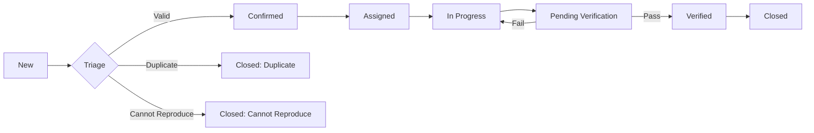

# ARKDL-0012: Vision & Strategy — Arkhitekton Quality Command Center (Defect Management Reimagined)

> **Status:** Research & Planning  
> **Type:** Product Vision & Strategy  
> **Target Module:** `/plan` → `/plan/quality` (New Submodule)  
> **Driver:** US-AI-AGENT-006 Expansion  

---

## Executive Summary: From Basic Bug Tracker to Quality Intelligence Platform

### Current State Assessment

**What We Have:**
- ✅ Basic defect CRUD (Create, Read, Update, Delete)
- ✅ Defect-to-Story linking (1:N relationship)
- ✅ Severity classification (Critical/High/Medium/Low)
- ✅ Type categorization (Bug/Regression/Performance/Security/Usability)
- ✅ Status workflow (Open → In Progress → Resolved → Closed)
- ✅ GitHub/Jira integration hooks (schema-ready, not fully implemented)
- ✅ Story-blocking logic (open defects prevent story completion)
- ✅ Basic UI embedded in Story dialog

**What We're Missing (Gap Analysis):**

| Feature Category | Industry Standard | Arkhitekton Current | Gap Severity |
| :--- | :--- | :--- | :--- |
| **Defect Triage** | Multi-stage triage workflow with review boards | None | 🔴 Critical |
| **Analytics & Metrics** | Defect density, MTTR, escape rate, trend analysis | None | 🔴 Critical |
| **Test Case Linking** | Bi-directional linking to test cases | None | 🔴 Critical |
| **Duplicate Detection** | AI-powered similarity matching | None | 🟡 High |
| **Root Cause Library** | Categorized root cause templates with patterns | Basic text field | 🟡 High |
| **Release Management** | Release-blocking defect views, version tagging | None | 🟡 High |
| **Defect Verification** | Dedicated verification workflow for QA sign-off | None | 🟡 High |
| **Impact Analysis** | Architecture component impact mapping | None | 🟠 Medium |
| **Defect Aging Reports** | SLA tracking, aging alerts, burndown | None | 🟠 Medium |
| **Mobile Defect Reporting** | On-site/remote defect logging | None | 🟢 Nice-to-Have |

---

## The Problem: Defects Are Treated as Second-Class Citizens

In the current system, defects are an afterthought—a simple list embedded within a user story. This creates several critical problems:

### 1. **Visibility Crisis**
- Defects are hidden inside story dialogs. You can't see the "big picture" of quality.
- No way to answer: *"How many critical security defects are open right now?"*
- No central defect dashboard or command center.

### 2. **No Defect Intelligence**
- Defects are just text. There's no pattern recognition.
- Can't identify: *"This is the 5th authentication bug this sprint"*
- No learning from historical defect data.

### 3. **Broken Quality Feedback Loop**
- No link between defects and test cases (what test failed?)
- No link between defects and architecture components (which service is breaking?)
- Developers fix defects in isolation without understanding systemic issues.

### 4. **Accountability Gaps**
- Who triages new defects?
- Who verifies the fix?
- What's the SLA for critical defects?

---

## The Vision: Arkhitekton Quality Command Center

Transform defect management from a **reactive bug list** to a **proactive quality intelligence platform** that:

1. **Predicts Quality Issues** — Use AI to detect patterns (e.g., "Component X has 80% of performance defects")
2. **Enforces Quality Gates** — Block releases when defect thresholds are exceeded
3. **Connects Defects to Architecture** — Map every defect to the Archimate/TOGAF component it affects
4. **Closes the Test-to-Defect Loop** — Auto-create defects from failed automated tests
5. **Provides Executive Visibility** — Real-time quality dashboards for stakeholders

---

## Strategic Pillars

### I. Dedicated Defect Management Submodule (`/plan/quality`)

**Decision:** Defects deserve their own first-class module, not a buried UI component.

**Why:**
- **Separation of Concerns**: Planning (stories/epics) ≠ Quality Management (defects/testing)
- **Dedicated UX**: Defect-specific views (Kanban board, heatmap, triage queue) don't fit in story dialogs
- **Scalability**: Large projects have 1000s of defects. Need pagination, advanced filtering, bulk operations
- **Team Roles**: QA Engineers need a "quality command center" that developers rarely visit

**Architecture:**
```
/plan (Existing)
  ├── /stories
  ├── /epics
  └── /quality (NEW SUBMODULE)
      ├── /defects (List view with advanced filters)
      ├── /defects/:id (Detail view)
      ├── /triage (Triage queue for new defects)
      ├── /analytics (Quality metrics dashboard)
      └── /verification (Defects awaiting QA sign-off)
```

### II. Defect Lifecycle Management (Not Just Status Changes)

**Current:** Open → In Progress → Resolved → Closed  
**Proposed:** A true quality workflow with gates and accountability



**Key Additions:**
- **Triage Stage**: QA Lead reviews and confirms legitimacy
- **Verification Stage**: QA must sign off before defect is closed
- **Rejection Reasons**: "Duplicate", "Cannot Reproduce", "By Design", "Won't Fix"

### III. Quality Metrics & Analytics (The "Dashboard")

**Metrics Every QA Manager Needs:**

| Metric | Definition | Business Value |
| :--- | :--- | :--- |
| **Defect Density** | Defects per 1000 lines of code or per story point | Predictive indicator of quality |
| **Mean Time to Resolve (MTTR)** | Average time from defect creation to closure | Team efficiency |
| **Defect Escape Rate** | % of defects found in production vs. QA | Process effectiveness |
| **Defect Removal Efficiency** | Defects found before release / Total defects | Quality gate efficacy |
| **Severity Distribution** | % Critical/High/Medium/Low over time | Risk assessment |
| **Defect Aging** | Open defects older than 30/60/90 days | SLA compliance |
| **Top Defect Components** | Architecture components with most defects | Architecture risk hotspots |
| **Reopened Defect Rate** | % of defects that reopen after fix | Fix quality |

### IV. Intelligent Defect Linking (Context is Everything)

**Link Defects to Everything:**

1. **User Stories** (already implemented ✅)
2. **Test Cases** (NEW) — "Failed Test: US-101-TC-03"
3. **Architecture Components** (NEW) — "Affected Component: Payment Gateway Microservice"
4. **Source Code** (NEW) — "File: `PaymentService.ts:245`"
5. **Requirements** (NEW) — Link to Wiki Requirements (when Wiki v2 is built)
6. **Releases/Versions** (NEW) — "Found in v1.2.0, Fixed in v1.2.1"

### V. AI-Powered Quality Insights

**Phase 1 (Rule-Based):**
- Duplicate detection via title similarity
- Automated severity suggestion based on keywords ("crash", "data loss" → Critical)
- Component auto-tagging from description

**Phase 2 (AI-Enhanced):**
- **Defect Clustering**: "These 5 defects are all related to caching"
- **Root Cause Prediction**: "Based on past defects, this is likely a race condition"
- **Test Case Generation**: "Suggest 3 test cases to prevent this regression"

---

## Product Roadmap

### Phase 1: Foundation & Dedicated Module (Sprint 1-2)
**Goal:** Elevate defects to first-class status with dedicated UI

| Story ID | Feature | Effort | Priority |
| :--- | :--- | :--- | :--- |
| **US-DEFECT-001** | **Defect List View** — Dedicated `/plan/quality/defects` page with table view, pagination, and filters (severity, status, assignee) | 5 pts | Critical |
| **US-DEFECT-002** | **Defect Detail Page** — `/plan/quality/defects/:id` with full defect history, comments thread, and linked stories | 5 pts | Critical |
| **US-DEFECT-003** | **Advanced Filtering** — Multi-select filters (severity, type, status, assignee, reporter, date range) with saved filter presets | 3 pts | High |
| **US-DEFECT-004** | **Defect Export** — Export defects as CSV/PDF for stakeholder reporting (similar to story PDF export) | 2 pts | High |

### Phase 2: Defect Lifecycle & Triage (Sprint 3-4)
**Goal:** Implement professional defect workflow with accountability

| Story ID | Feature | Effort | Priority |
| :--- | :--- | :--- | :--- |
| **US-DEFECT-005** | **Triage Queue** — `/plan/quality/triage` view showing all "New" defects with bulk triage actions (Confirm/Reject/Assign) | 5 pts | Critical |
| **US-DEFECT-006** | **Verification Workflow** — "Pending Verification" status; QA can verify fix or reopen defect with reason | 5 pts | Critical |
| **US-DEFECT-007** | **Defect Templates** — Pre-filled templates for common defect types (UI Bug, API Error, Performance Issue) with structured fields | 3 pts | High |
| **US-DEFECT-008** | **Rejection Reasons** — When closing defects, require reason (Duplicate of X, Cannot Reproduce, By Design, Won't Fix) | 2 pts | High |
| **US-DEFECT-009** | **Defect Duplication Detection** — On defect creation, show similar existing defects based on title/description similarity | 5 pts | Medium |

### Phase 3: Quality Analytics & Dashboards (Sprint 5-6)
**Goal:** Provide executive visibility and data-driven quality insights

| Story ID | Feature | Effort | Priority |
| :--- | :--- | :--- | :--- |
| **US-DEFECT-010** | **Quality Dashboard** — `/plan/quality/analytics` with key metrics (open defects by severity, MTTR, defect aging, severity distribution) | 8 pts | Critical |
| **US-DEFECT-011** | **Defect Trend Analysis** — Line charts showing defect creation/resolution rates over time (daily/weekly/monthly) | 5 pts | High |
| **US-DEFECT-012** | **Component Heatmap** — Visual heatmap showing which architecture components have the most defects | 8 pts | High |
| **US-DEFECT-013** | **Defect Aging Report** — List of defects open >30/60/90 days with aging alerts and SLA breach warnings | 3 pts | High |
| **US-DEFECT-014** | **Quality Gates** — Define quality thresholds (e.g., "No Critical defects", "MTTR < 3 days") and show pass/fail status | 5 pts | Medium |

### Phase 4: Intelligent Linking & Integration (Sprint 7-8)
**Goal:** Connect defects to the broader ecosystem

| Story ID | Feature | Effort | Priority |
| :--- | :--- | :--- | :--- |
| **US-DEFECT-015** | **Test Case Linking** — Link defects to test cases; show "Test Case: TC-101 (Failed)" in defect detail | 5 pts | Critical |
| **US-DEFECT-016** | **Architecture Component Linking** — Link defects to Archimate/TOGAF components from the catalog; show component health | 8 pts | Critical |
| **US-DEFECT-017** | **Source Code Linking** — Link defects to specific files/lines; show "Affected Files: PaymentService.ts:245" | 5 pts | High |
| **US-DEFECT-018** | **Release Version Tagging** — Tag defects with "Found in Version" and "Fixed in Version"; filter by release | 3 pts | High |
| **US-DEFECT-019** | **Auto-Defect from Failed Tests** — Integration: When automated tests fail, auto-create defect with test details | 8 pts | Medium |

### Phase 5: AI & Advanced Features (Sprint 9+)
**Goal:** Intelligent quality management with AI assistance

| Story ID | Feature | Effort | Priority |
| :--- | :--- | :--- | :--- |
| **US-DEFECT-020** | **AI Duplicate Detection** — Use semantic similarity (embeddings) to detect duplicates beyond keyword matching | 8 pts | Medium |
| **US-DEFECT-021** | **Root Cause Library** — Predefined root cause categories (Race Condition, Memory Leak, Configuration Error) with templates | 3 pts | Medium |
| **US-DEFECT-022** | **AI Severity Suggestion** — Analyze defect description and suggest severity using Claude API | 5 pts | Medium |
| **US-DEFECT-023** | **Defect Pattern Recognition** — "You've had 5 auth defects this month—consider reviewing authentication module" | 13 pts | Low |
| **US-DEFECT-024** | **Predictive Defect Analytics** — "Based on code churn and defect history, Component X is at risk" | 13 pts | Low |

---

## Technical Architecture

### Data Model Enhancements

**Current Schema:**
```typescript
defects {
  id, userStoryId, title, description, severity, type, status,
  discoveredBy, assignedTo, rootCause, resolution,
  githubIssue, githubCommits, jiraIssueKey,
  createdAt, updatedAt, resolvedAt
}
```

**Proposed Additions:**
```typescript
defects {
  // Existing fields...
  
  // NEW: Lifecycle Management
  triageStatus: 'pending' | 'confirmed' | 'rejected',
  rejectionReason?: string,
  verifiedBy?: string,
  verifiedAt?: timestamp,
  reopenCount: integer,
  reopenReason?: string,
  
  // NEW: Intelligent Linking
  testCaseId?: string,  // Link to future Test Case entity
  componentIds: string[],  // Link to Architecture Elements
  affectedFiles: string[],  // Source code files
  foundInVersion?: string,
  fixedInVersion?: string,
  
  // NEW: Quality Metrics
  timeToTriage?: interval,  // Time from creation to triage
  timeToResolve?: interval,  // Time from creation to resolution
  severityChangeLog: jsonb,  // Track severity changes
  
  // NEW: Rich Content
  attachments: string[],  // URLs to screenshots, logs
  reproducibilityRate?: 'always' | 'sometimes' | 'rare',
  environmentInfo?: jsonb,  // Browser, OS, version
  
  // NEW: AI Enhancement
  similarDefectIds: string[],  // AI-detected duplicates
  suggestedRootCause?: string,
  embeddingVector?: vector,  // For semantic search (pgvector)
}
```

**New Junction Tables:**
```typescript
defect_components {
  defectId: string,
  componentId: string,  // References architecture_elements
  impactLevel: 'primary' | 'secondary',
}

defect_test_cases {
  defectId: string,
  testCaseId: string,
  relationshipType: 'found_by' | 'verified_by' | 'prevented_by',
}

defect_comments {
  id, defectId, userId, comment, createdAt
}
```

### API Routes Expansion

**Current Endpoints:**
- `GET /api/defects` ✅
- `GET /api/defects/:id` ✅
- `POST /api/defects` ✅
- `PATCH /api/defects/:id` ✅
- `DELETE /api/defects/:id` ✅
- `GET /api/user-stories/:id/defects` ✅

**New Endpoints:**
```typescript
// Triage & Workflow
POST   /api/defects/:id/triage       // Confirm/reject defect
POST   /api/defects/:id/verify       // QA verification
POST   /api/defects/:id/reopen       // Reopen with reason

// Analytics
GET    /api/defects/metrics          // Aggregate metrics
GET    /api/defects/trends           // Time-series data
GET    /api/defects/aging            // Defects by age buckets

// Intelligent Features
GET    /api/defects/:id/similar      // Find similar defects
POST   /api/defects/:id/suggest-rootcause  // AI suggestion
GET    /api/defects/duplicates       // Potential duplicates

// Linking
POST   /api/defects/:id/components   // Link to components
POST   /api/defects/:id/test-cases   // Link to test cases
GET    /api/components/:id/defects   // Defects by component

// Bulk Operations
POST   /api/defects/bulk/triage      // Triage multiple defects
POST   /api/defects/bulk/assign      // Bulk reassignment
```

---

## UI/UX Design Principles

### 1. **Defect Command Center (Home View)**
- **Hero Metrics**: Large cards showing Critical (red), High (orange), Open defects
- **Triage Queue**: "You have 12 defects awaiting triage"
- **Quick Filters**: "My Defects", "Critical Security", "Needs Verification"
- **Defect Burndown Chart**: Trend line showing progress

### 2. **Defect List View (Advanced Table)**
- **Columns**: ID, Title, Severity, Status, Type, Assignee, Age, Story
- **Inline Actions**: Hover to Assign, Change Status, Add Comment
- **Bulk Select**: Checkboxes for multi-select with bulk actions toolbar
- **Saved Filters**: "My Critical Defects", "Open Security Issues"

### 3. **Defect Detail View (Information-Dense)**
- **3-Column Layout**:
  - **Left**: Defect fields (editable inline)
  - **Center**: Description, Reproduction Steps, Resolution
  - **Right**: Activity Timeline (status changes, comments, linked items)
- **Linked Items Section**: Show linked story, test cases, components, code files
- **Similar Defects**: "3 similar defects found" with links

### 4. **Analytics Dashboard (Data Viz)**
- **Top Section**: KPI Cards (Total Defects, MTTR, Defect Density, Escape Rate)
- **Charts**: Severity Distribution (Pie), Defect Trends (Line), Component Heatmap (TreeMap)
- **Filters**: Date Range, Epic, Component, Team

---

## Competitive Analysis

| Feature | Jira | Linear | Azure DevOps | Arkhitekton (Proposed) |
| :--- | :---: | :---: | :---: | :---: |
| Dedicated Defect Module | ✅ | ✅ | ✅ | ✅ (Phase 1) |
| Defect Triage Workflow | ✅ | ❌ | ✅ | ✅ (Phase 2) |
| Test Case Linking | ✅ | ❌ | ✅ | ✅ (Phase 4) |
| Architecture Linking | ❌ | ❌ | ❌ | ✅ (Phase 4) ⭐ |
| Quality Analytics Dashboard | ✅ | ⚠️  | ✅ | ✅ (Phase 3) |
| AI Duplicate Detection | ⚠️  | ❌ | ❌ | ✅ (Phase 5) ⭐ |
| Component Heatmap | ❌ | ❌ | ❌ | ✅ (Phase 3) ⭐ |
| Root Cause Library | ⚠️  | ❌ | ⚠️  | ✅ (Phase 5) |

**Legend:** ✅ Full Support | ⚠️ Partial Support | ❌ Not Available | ⭐ Unique to Arkhitekton

**Arkhitekton Differentiators:**
1. **Architecture-Defect Linking**: Map defects to TOGAF/Archimate components
2. **Component Health Heatmap**: Visual representation of "trouble spots"
3. **AI-Powered Insights**: Defect clustering, pattern recognition

---

## Success Metrics

**After Phase 1-2 (6 months):**
- Defect Management used by 100% of QA team
- 90% of defects triaged within 24 hours
- Average MTTR < 5 days for High/Critical defects

**After Phase 3-4 (1 year):**
- Defect density decreased by 30%
- Zero critical defects in production for 6 consecutive months
- 80% of defects linked to architecture components

**After Phase 5 (18 months):**
- AI duplicate detection accuracy > 85%
- Proactive identification of 5+ high-risk components per quarter
- 50% reduction in defect reopens due to improved root cause analysis

---

## Conclusion: Why This Matters

**Defect management is not "just bug tracking"**—it's the feedback loop that drives continuous improvement. By transforming it into a first-class Quality Command Center, Arkhitekton will:

1. **Shift from Reactive to Proactive** — Predict quality issues before they escape
2. **Connect Quality to Architecture** — Understand which components are fragile
3. **Provide Executive Visibility** — Answer "Are we ready to ship?" with data
4. **Learn from Defects** — Build institutional knowledge of failure patterns

This is not a "nice to have"—it's the foundation of a mature engineering organization.

---

**Total Estimated Effort:** ~140 story points across 24 user stories  
**Timeline:** 5 phases over 9-12 sprints (assuming 2-week sprints)  
**ROI:** Reduced production defects, faster resolution, improved team efficiency

