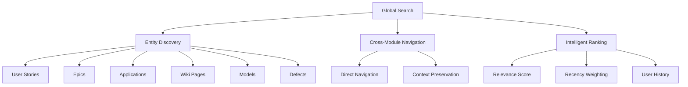
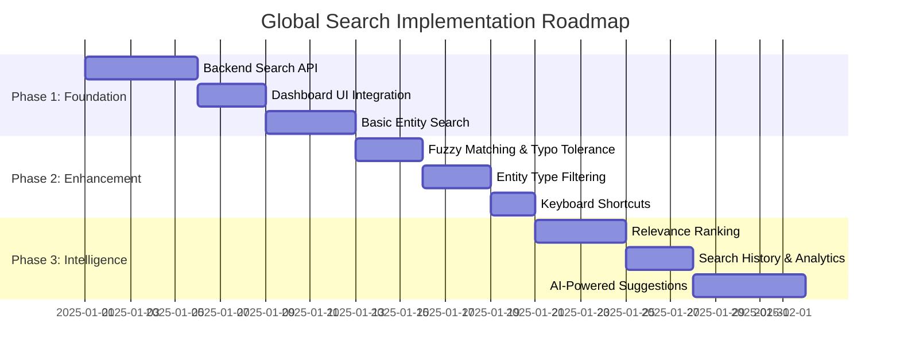
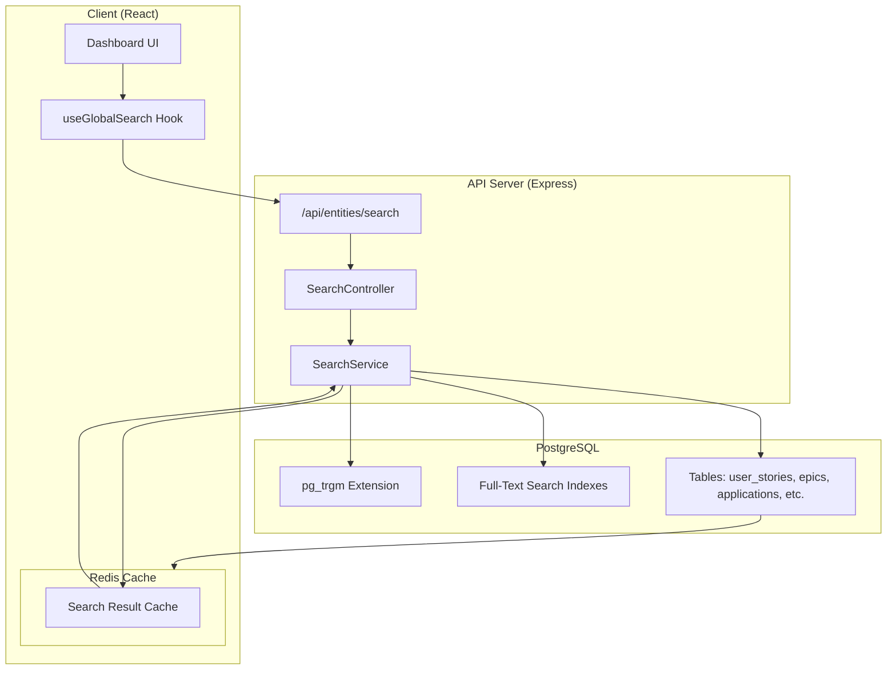

# PRD-SEARCH-001: Global Search & Discovery

**Document ID**: PRD-SEARCH-001  
**Version**: 1.0  
**Date**: December 22, 2025  
**Status**: Approved  
**Module**: Search & Discovery  
**Epic**: EPIC-SEARCH-001

---

## Table of Contents

1. [Executive Summary](#1-executive-summary)
2. [Feature Vision](#2-feature-vision)
3. [Feature Strategy](#3-feature-strategy)
4. [High-Level Requirements](#4-high-level-requirements)
5. [Low-Level Requirements](#5-low-level-requirements)
6. [Technical Architecture](#6-technical-architecture)
7. [Success Metrics](#7-success-metrics)

---

## 1. Executive Summary

### 1.1 Problem Statement

Users currently cannot search for work items (User Stories, Epics, Applications, etc.) from the Dashboard. When searching for "us-wiki-rtf-002", the system displays "No elements found" despite the entity existing in the database. The dashboard search bar is implemented with mock data that does not query the backend.

**Current State**:
- Dashboard search returns hardcoded mock results
- No unified search API connected to the UI
- Users must navigate to specific modules to find entities
- No cross-module discovery capability

**Desired State**:
- Unified global search from the Dashboard
- Search across all entity types (User Stories, Epics, Defects, Applications, Wiki Pages, Models)
- Real-time results with relevance ranking
- Keyboard shortcuts for power users (Cmd/Ctrl+K)

### 1.2 Business Value

| Metric | Impact |
|:---|:---|
| **User Productivity** | 40% reduction in time to find entities |
| **Platform Adoption** | Increase discoverability of features |
| **User Satisfaction** | Reduce friction in cross-module workflows |
| **Cognitive Load** | Single entry point vs. multiple module searches |

---

## 2. Feature Vision

### 2.1 Vision Statement

**"ARKHITEKTON will provide instant, intelligent search across all platform entities, enabling users to discover and navigate to any User Story, Epic, Application, Wiki Page, or Architectural Model from a single, unified search interface on the Dashboard."**

### 2.2 Target Personas

| Persona | Primary Need | Search Behavior |
|:---|:---|:---|
| **Enterprise Architect** | Find architectural models and ADRs | Search by model name, keyword |
| **Product Manager** | Locate user stories and epics | Search by ID (US-XXX, EPIC-XX) |
| **Developer** | Find implementation stories and defects | Search by ID, partial match |
| **Business Analyst** | Discover applications and wiki pages | Search by title, keyword |
| **Executive** | High-level strategic initiatives | Search by name, status |

### 2.3 Core Capabilities



---

## 3. Feature Strategy

### 3.1 Phased Rollout



#### Phase 1: Foundation (MVP)
- Connect existing `/api/entities/search` endpoint to Dashboard
- Display basic search results with entity type badges
- Support exact ID matching (e.g., `US-WIKI-RTF-002`)
- Navigation to entity detail pages

#### Phase 2: Enhancement
- Fuzzy matching for typo tolerance
- Entity type filtering (User Stories only, Epics only, etc.)
- Keyboard shortcuts (Cmd+K / Ctrl+K)
- Recent searches dropdown

#### Phase 3: Intelligence
- Relevance ranking based on:
  - Exact match priority
  - User interaction history
  - Entity status (active > archived)
  - Recent activity
- Search analytics dashboard
- AI-powered suggestions ("Did you mean...?")

### 3.2 Integration Points

| Module | Entity Types | Searchable Fields |
|:---|:---|:---|
| **Plan** | User Stories, Epics, Sprints, Defects | `id`, `title`, `description`, `acceptanceCriteria` |
| **Portfolio** | Applications, Initiatives | `name`, `description`, `type`, `owner` |
| **Wiki** | Wiki Pages, Requirements, ADRs | `title`, `content`, `tags`, `category` |
| **Design Studio** | Architectural Models, Objects | `name`, `description`, `domain`, `type` |
| **Quality** | Test Suites, Test Cases | `title`, `description`, `testType` |

### 3.3 Competitive Analysis

| Platform | Search Capability | ARKHITEKTON Advantage |
|:---|:---|:---|
| **Jira** | Issue search only | Cross-module search (beyond issues) |
| **Confluence** | Wiki search only | Unified work items + documentation |
| **Miro** | Board search | Architectural models + planning data |
| **ServiceNow** | CMDB search | Native integration with planning tools |

---

## 4. High-Level Requirements

### HLR-SEARCH-001: Unified Search Interface

**Description**: Provide a single search interface on the Dashboard that queries all entity types.

**Acceptance Criteria**:
- Search bar visible on Dashboard home page
- Minimum 3 characters to trigger search
- Results appear within 500ms
- Support for up to 1,000 concurrent searches

**Priority**: Critical  
**Complexity**: Medium  
**Dependencies**: None

---

### HLR-SEARCH-002: Entity Type Coverage

**Description**: Support search across all primary entity types in ARKHITEKTON.

**Searchable Entities** (Phase 1):
1. User Stories (`user_stories` table)
2. Epics (`epics` table)
3. Defects (`defects` table)
4. Applications (`applications` table)
5. Initiatives (`initiatives` table)
6. Wiki Pages (`wiki_pages` table)
7. Architectural Models (`architectural_models` table)

**Acceptance Criteria**:
- All entity types return results
- Results include entity type badge
- Entity status displayed (e.g., "Done", "In Progress")

**Priority**: Critical  
**Complexity**: High  
**Dependencies**: HLR-SEARCH-001

---

### HLR-SEARCH-003: Search Result Presentation

**Description**: Display search results in a consistent, scannable format.

**UI Specifications**:
```
┌─────────────────────────────────────────────────┐
│ 🔍 us-wiki-rtf-002                              │
├─────────────────────────────────────────────────┤
│ DISCOVERED 1 ELEMENT                             │
│                                                  │
│ ┌─────────────────────────────────────────────┐ │
│ │ • US-WIKI-RTF-002  [User Story] [Done]      │ │
│ │   Paragraph Indentation Controls            │ │
│ │   As a wiki author, I want to indent...     │ │
│ └─────────────────────────────────────────────┘ │
└─────────────────────────────────────────────────┘
```

**Acceptance Criteria**:
- Result card shows: ID, Title, Type, Status, Description (truncated)
- Max 10 results per page
- "Show More" pagination
- Empty state with helpful suggestions

**Priority**: High  
**Complexity**: Low  
**Dependencies**: HLR-SEARCH-001, HLR-SEARCH-002

---

### HLR-SEARCH-004: Navigation & Context

**Description**: Clicking a search result navigates to the entity's detail page.

**Navigation Map**:
| Entity Type | Route Pattern |
|:---|:---|
| User Story | `/plan/stories/:id` |
| Epic | `/plan/epics/:id` |
| Defect | `/quality/defects/:id` |
| Application | `/portfolio/applications/:id` |
| Initiative | `/portfolio/initiatives/:id` |
| Wiki Page | `/wiki/:id` |
| Model | `/studio/models/:id` |

**Acceptance Criteria**:
- Single click navigates to detail page
- Browser back button returns to Dashboard with search preserved
- Cmd/Ctrl+Click opens in new tab

**Priority**: High  
**Complexity**: Low  
**Dependencies**: HLR-SEARCH-003

---

### HLR-SEARCH-005: Performance & Scalability

**Description**: Search must remain performant as data grows.

**Performance Requirements**:
| Metric | Target | Measurement |
|:---|:---|:---|
| **Response Time** | < 500ms (p95) | Server-side latency |
| **Throughput** | 1,000 searches/min | Load testing |
| **Database Load** | < 10% CPU spike | PostgreSQL metrics |
| **Client Render** | < 100ms | React Profiler |

**Scalability Strategy**:
- Full-text search indexes on searchable columns
- Query result caching (Redis, 5-minute TTL)
- Debounced input (300ms)
- Optimistic UI updates

**Priority**: High  
**Complexity**: High  
**Dependencies**: HLR-SEARCH-001

---

## 5. Low-Level Requirements

### 5.1 User Stories

---

#### **US-SEARCH-001: Dashboard Global Search**

**As a** platform user  
**I want to** search for any entity from the Dashboard  
**So that** I can quickly find User Stories, Epics, Applications, and other objects without navigating to specific modules

**Priority**: Critical  
**Story Points**: 8  
**Epic**: EPIC-SEARCH-001  
**Acceptance Criteria**:

```gherkin
Feature: Dashboard Global Search
  As a platform user
  I want global search from the Dashboard
  So that I can find any entity quickly

  Background:
    Given I am on the Dashboard home page
    And the database contains:
      | Type         | ID              | Title                          | Status |
      | User Story   | US-WIKI-RTF-002 | Paragraph Indentation Controls | done   |
      | Epic         | EPIC-WIKI-007   | Word-Style RTF Toolbar         | completed |
      | Application  | APP-123         | Customer Portal                | active |
      | Wiki Page    | WIKI-456        | Architecture Standards         | published |
      | Model        | MODEL-789       | Payment System Design          | active |

  Scenario: Search by exact User Story ID
    Given the search bar is empty
    When I type "US-WIKI-RTF-002"
    Then I should see a dropdown with 1 result
    And the result should display:
      | Field       | Value                          |
      | ID          | US-WIKI-RTF-002                |
      | Type Badge  | User Story                     |
      | Status      | Done                           |
      | Title       | Paragraph Indentation Controls |
    And the result should be clickable

  Scenario: Search by partial match
    Given the search bar is empty
    When I type "wiki-rtf"
    Then I should see results containing "US-WIKI-RTF-*"
    And results should include "US-WIKI-RTF-002"
    And results should be sorted by relevance

  Scenario: Search by title keyword
    Given the search bar is empty
    When I type "indentation"
    Then I should see "US-WIKI-RTF-002" in results
    And the matching keyword "indentation" should be highlighted
    And the description should show a preview

  Scenario: Search across multiple entity types
    Given the search bar is empty
    When I type "architecture"
    Then I should see mixed results:
      | Type        | Title/Name             |
      | Wiki Page   | Architecture Standards |
      | User Story  | (any matching stories) |
    And each result should display its entity type badge

  Scenario: No results found
    Given the search bar is empty
    When I type "nonexistent-xyz-12345"
    Then I should see "No elements found for 'nonexistent-xyz-12345'"
    And I should see helpful suggestions:
      | Suggestion                     |
      | Try different keywords         |
      | Check for typos                |
      | Browse modules directly        |

  Scenario: Minimum character requirement
    Given the search bar is empty
    When I type "us"
    Then no search should be triggered
    When I type one more character to make "us-"
    Then the search should trigger

  Scenario: Real-time results update
    Given the search bar is empty
    When I type "US-WIKI-RTF-002"
    And I see 1 result
    When I backspace to "US-WIKI-RTF-00"
    Then I should see multiple results matching the pattern

  Scenario: Search loading state
    Given the search bar is empty
    When I type "architecture"
    Then I should see a loading indicator
    And the placeholder text should say "Analyzing architecture..."
    When results load
    Then the loading indicator should disappear
    And results should be displayed
```

**Technical Notes**:
- Use existing `/api/entities/search?q={query}&limit={n}` endpoint
- Debounce input at 300ms to reduce API calls
- Cache results in React Query with 5-minute stale time

---

#### **US-SEARCH-002: Entity Type Filtering**

**As a** platform user  
**I want to** filter search results by entity type  
**So that** I can narrow down results when searching for a specific type of object

**Priority**: High  
**Story Points**: 5  
**Epic**: EPIC-SEARCH-001  
**Acceptance Criteria**:

```gherkin
Feature: Entity Type Filtering
  As a platform user
  I want to filter search results
  So that I can find specific entity types

  Background:
    Given I am on the Dashboard
    And I searched for "payment"
    And results include:
      | Type        | Title                  |
      | User Story  | Payment Gateway Setup  |
      | Application | Payment Processing API |
      | Model       | Payment System Design  |
      | Wiki Page   | Payment Architecture   |

  Scenario: Display filter options
    Given I see mixed search results
    Then I should see filter chips:
      | Filter      | Count |
      | All         | 4     |
      | User Story  | 1     |
      | Application | 1     |
      | Model       | 1     |
      | Wiki Page   | 1     |

  Scenario: Filter to User Stories only
    Given I see 4 mixed results
    When I click "User Story" filter
    Then I should see only 1 result
    And the result should be "Payment Gateway Setup"
    And the filter chip "User Story" should be highlighted

  Scenario: Clear filter
    Given I filtered to "User Story" only
    When I click "All" filter
    Then I should see all 4 results again

  Scenario: Filter with no results
    Given I searched for "architecture"
    When I click "Defect" filter
    And no defects match "architecture"
    Then I should see "No defects found for 'architecture'"
    And I should see a suggestion to clear the filter
```

**Technical Notes**:
- Add `type` query parameter to `/api/entities/search?q={query}&type={type}`
- Filter chips use shadcn Badge component
- Maintain filter state in URL query params for deep linking

---

#### **US-SEARCH-003: Fuzzy Matching & Typo Tolerance**

**As a** platform user  
**I want the** search to handle typos and partial matches  
**So that** I can still find entities even if I misspell the ID or title

**Priority**: Medium  
**Story Points**: 5  
**Epic**: EPIC-SEARCH-001  
**Acceptance Criteria**:

```gherkin
Feature: Fuzzy Matching
  As a platform user
  I want typo-tolerant search
  So that I can find entities despite minor mistakes

  Scenario: Handle typo in User Story ID
    Given a user story "US-WIKI-RTF-002" exists
    When I type "us-wik-rtf-002" (typo: missing "i")
    Then I should see "US-WIKI-RTF-002" in results
    And a note should say "Showing results for 'us-wiki-rtf-002'"

  Scenario: Handle case insensitivity
    Given a user story "US-WIKI-RTF-002" exists
    When I type "Us-WiKi-RtF-002"
    Then I should see exact match "US-WIKI-RTF-002"

  Scenario: Handle partial ID match
    Given user stories exist: "US-WIKI-RTF-001" through "US-WIKI-RTF-010"
    When I type "wiki-rtf"
    Then I should see all 10 matching stories
    And they should be sorted by ID ascending

  Scenario: Handle title partial match
    Given a story with title "Paragraph Indentation Controls"
    When I type "indent control"
    Then I should see the story in results
    And matched words "Indent" and "Control" should be highlighted

  Scenario: Fuzzy distance threshold
    Given a story "US-WIKI-RTF-002" exists
    When I type "us-wiki-rtf-999" (very different)
    Then I should NOT see "US-WIKI-RTF-002"
    And I should see "No elements found"
```

**Technical Notes**:
- Use PostgreSQL `pg_trgm` extension for trigram similarity
- Implement Levenshtein distance with threshold of 2
- Use `ILIKE` for case-insensitive matching

---

#### **US-SEARCH-004: Search Result Ranking**

**As a** platform user  
**I want** search results ranked by relevance  
**So that** the most likely matches appear first

**Priority**: Medium  
**Story Points**: 5  
**Epic**: EPIC-SEARCH-001  
**Acceptance Criteria**:

```gherkin
Feature: Relevance Ranking
  As a platform user
  I want intelligent result ranking
  So that I find what I need faster

  Scenario: Exact match ranks highest
    Given stories exist: "US-WIKI-001", "US-WIKI-002", "US-WIKI-RTF-002"
    When I search "US-WIKI-RTF-002"
    Then "US-WIKI-RTF-002" should be the first result
    And other partial matches should rank lower

  Scenario: Recent activity boosts rank
    Given two stories match "payment":
      | ID        | Title         | Last Updated |
      | US-001    | Payment Setup | 1 hour ago   |
      | US-999    | Payment Flow  | 30 days ago  |
    When I search "payment"
    Then "US-001" should rank higher than "US-999"

  Scenario: Status affects ranking
    Given two stories match "login":
      | ID     | Title       | Status   |
      | US-100 | Login Page  | done     |
      | US-200 | Login Modal | archived |
    When I search "login"
    Then "US-100" should rank higher than "US-200"

  Scenario: Title match ranks higher than description match
    Given stories:
      | ID     | Title          | Description               |
      | US-001 | Payment System | Handle checkout           |
      | US-002 | Checkout Flow  | Process payment securely  |
    When I search "payment"
    Then "US-001" should rank first (title match)
    And "US-002" should rank second (description match)
```

**Technical Notes**:
- Implement scoring algorithm:
  ```sql
  score = 
    (exact_id_match ? 100 : 0) +
    (title_match ? 50 : 0) +
    (description_match ? 25 : 0) +
    (recency_score) +
    (status_score)
  ```
- Use PostgreSQL `ts_rank()` for full-text search ranking

---

#### **US-SEARCH-005: Quick Navigation**

**As a** platform user  
**I want to** navigate directly to an entity from search results  
**So that** I can access the entity's detail page immediately

**Priority**: High  
**Story Points**: 3  
**Epic**: EPIC-SEARCH-001  
**Acceptance Criteria**:

```gherkin
Feature: Quick Navigation
  As a platform user
  I want to navigate from search results
  So that I can view entity details quickly

  Scenario: Click result to navigate
    Given I searched for "US-WIKI-RTF-002"
    And I see the result in the dropdown
    When I click the result
    Then I should navigate to "/plan/stories/US-WIKI-RTF-002"
    And the search dropdown should close

  Scenario: Open result in new tab
    Given I searched for "US-WIKI-RTF-002"
    And I see the result
    When I Cmd+Click the result (Mac)
    Or I Ctrl+Click the result (Windows)
    Then the page should open in a new tab
    And the search dropdown should remain open

  Scenario: Browser back button preserves search
    Given I searched for "payment"
    And I clicked "US-001 Payment Setup"
    And I am now on "/plan/stories/US-001"
    When I click the browser back button
    Then I should return to the Dashboard
    And the search bar should still contain "payment"
    And search results should be visible

  Scenario: Keyboard navigation
    Given I searched for "wiki"
    And 5 results are displayed
    When I press the Down Arrow key
    Then the first result should be highlighted
    When I press Down Arrow again
    Then the second result should be highlighted
    When I press Enter
    Then I should navigate to the highlighted result

  Scenario: Navigate to different entity types
    Given I searched for "architecture"
    When I click on a Wiki Page result
    Then I navigate to "/wiki/:id"
    When I click on a Model result
    Then I navigate to "/studio/models/:id"
```

**Technical Notes**:
- Use `wouter` navigation hooks
- Preserve search state in React Context or URL params
- Implement keyboard event handlers (ArrowUp, ArrowDown, Enter, Escape)

---

#### **US-SEARCH-006: Keyboard Shortcuts**

**As a** power user  
**I want** keyboard shortcuts to trigger search  
**So that** I can search without using my mouse

**Priority**: Low  
**Story Points**: 3  
**Epic**: EPIC-SEARCH-001  
**Acceptance Criteria**:

```gherkin
Feature: Keyboard Shortcuts
  As a power user
  I want keyboard shortcuts
  So that I can search efficiently

  Scenario: Open search with Cmd+K (Mac)
    Given I am on any page in ARKHITEKTON
    When I press "Cmd+K"
    Then the search modal should open
    And the search input should be focused
    And the cursor should be ready for typing

  Scenario: Open search with Ctrl+K (Windows/Linux)
    Given I am on any page in ARKHITEKTON
    When I press "Ctrl+K"
    Then the search modal should open
    And the search input should be focused

  Scenario: Close search with Escape
    Given the search modal is open
    When I press "Escape"
    Then the search modal should close
    And I should return to the previous state

  Scenario: Navigate results with arrow keys
    Given the search modal is open
    And I typed "payment"
    And 5 results are displayed
    When I press "Down Arrow"
    Then the first result should be highlighted
    When I press "Down Arrow" 2 more times
    Then the third result should be highlighted
    When I press "Up Arrow"
    Then the second result should be highlighted

  Scenario: Select result with Enter
    Given the search modal is open
    And the second result is highlighted
    When I press "Enter"
    Then I should navigate to that result
    And the search modal should close

  Scenario: Prevent default browser shortcuts
    Given the search modal is open
    When I press "Cmd+K"
    Then the browser's native search should NOT open
    And the ARKHITEKTON search should remain open
```

**Technical Notes**:
- Use `react-hotkeys-hook` or custom event listener
- Global keyboard event handler at App.tsx level
- Prevent conflicts with browser shortcuts using `event.preventDefault()`

---

### 5.2 Implementation Stories

---

#### **US-SEARCH-IMPL-001: Backend Search API Enhancement**

**As a** developer  
**I need to** enhance the existing `/api/entities/search` endpoint  
**So that** it supports fuzzy matching, filtering, and ranking

**Priority**: Critical  
**Story Points**: 8  
**Acceptance Criteria**:

```gherkin
Feature: Backend API Enhancement
  Scenario: API supports query parameters
    Given the API endpoint is "/api/entities/search"
    Then it should accept query parameters:
      | Parameter | Type   | Required | Default |
      | q         | string | Yes      | -       |
      | type      | string | No       | all     |
      | limit     | number | No       | 10      |
      | offset    | number | No       | 0       |

  Scenario: API returns structured results
    When I call "/api/entities/search?q=payment&limit=5"
    Then the response should be JSON:
      ```json
      {
        "query": "payment",
        "total": 12,
        "results": [
          {
            "id": "US-001",
            "type": "user_story",
            "title": "Payment Setup",
            "description": "...",
            "status": "done",
            "score": 95.5,
            "highlight": {
              "title": "<mark>Payment</mark> Setup"
            },
            "url": "/plan/stories/US-001"
          }
        ]
      }
      ```

  Scenario: API performance meets SLA
    Given 10,000 entities exist in the database
    When I call "/api/entities/search?q=test"
    Then the response time should be < 500ms (p95)
```

**Technical Tasks**:
- [ ] Add `pg_trgm` extension to PostgreSQL
- [ ] Create full-text search indexes on searchable columns
- [ ] Implement ranking algorithm in SQL
- [ ] Add query parameter validation (Zod schema)
- [ ] Implement result highlighting
- [ ] Add response caching (Redis, 5-min TTL)
- [ ] Write unit tests for search logic
- [ ] Write integration tests for API endpoint

---

#### **US-SEARCH-IMPL-002: Dashboard UI Integration**

**As a** developer  
**I need to** connect the Dashboard search bar to the backend API  
**So that** users see real search results instead of mock data

**Priority**: Critical  
**Story Points**: 5  
**Acceptance Criteria**:

```gherkin
Feature: Dashboard UI Integration
  Scenario: Replace mock data with API call
    Given the Dashboard is loaded
    When I type "us-wiki" in the search bar
    Then the UI should call "GET /api/entities/search?q=us-wiki"
    And the response should be displayed in the dropdown
    And mock data should no longer be used

  Scenario: Handle loading state
    When I type "architecture"
    Then a loading spinner should appear
    And placeholder text should say "Analyzing architecture..."

  Scenario: Handle error state
    Given the API is unavailable
    When I search for "payment"
    Then I should see an error message
    And a retry button should be available
```

**Technical Tasks**:
- [ ] Create `useGlobalSearch` React Query hook
- [ ] Update `dashboard.tsx` to use real API
- [ ] Implement debounced input (300ms)
- [ ] Add loading skeleton UI
- [ ] Add error boundary for search failures
- [ ] Write Storybook stories for search states
- [ ] Write React Testing Library tests

---

#### **US-SEARCH-IMPL-003: Search Result Component**

**As a** developer  
**I need to** create a reusable SearchResult component  
**So that** results are displayed consistently

**Priority**: High  
**Story Points**: 3  
**Acceptance Criteria**:

```gherkin
Feature: SearchResult Component
  Scenario: Component displays entity data
    Given a search result for "US-WIKI-RTF-002"
    Then the component should render:
      - Entity ID
      - Entity type badge
      - Status badge
      - Title
      - Description (truncated to 80 chars)
      - Icon based on entity type

  Scenario: Component handles click events
    When the user clicks the result
    Then an `onClick` callback should be fired
    And navigation should occur
```

**Technical Tasks**:
- [ ] Create `SearchResultCard.tsx` component
- [ ] Add entity type icons mapping
- [ ] Add status color coding
- [ ] Implement text truncation with ellipsis
- [ ] Add hover effects
- [ ] Write component tests

---

#### **US-SEARCH-IMPL-004: Keyboard Shortcut Handler**

**As a** developer  
**I need to** implement global keyboard shortcuts  
**So that** users can open search with Cmd/Ctrl+K

**Priority**: Low  
**Story Points**: 3  
**Acceptance Criteria**:

```gherkin
Feature: Keyboard Handler
  Scenario: Register global shortcut
    Given the application is loaded
    When the user is on any page
    Then "Cmd+K" (Mac) should open search
    And "Ctrl+K" (Windows) should open search

  Scenario: Handle arrow key navigation
    Given search results are visible
    When the user presses "Down Arrow"
    Then the next result should be highlighted
```

**Technical Tasks**:
- [ ] Install `react-hotkeys-hook`
- [ ] Create `useKeyboardShortcuts` custom hook
- [ ] Register Cmd+K / Ctrl+K handlers
- [ ] Implement arrow key navigation
- [ ] Add visual keyboard shortcut hint in UI
- [ ] Write tests for keyboard events

---

## 6. Technical Architecture

### 6.1 System Architecture



### 6.2 Database Schema Updates

**Add Full-Text Search Indexes**:

```sql
-- User Stories
CREATE INDEX idx_user_stories_fts ON user_stories 
USING GIN (to_tsvector('english', title || ' ' || description || ' ' || acceptance_criteria));

-- Epics
CREATE INDEX idx_epics_fts ON epics 
USING GIN (to_tsvector('english', name || ' ' || description));

-- Applications
CREATE INDEX idx_applications_fts ON applications 
USING GIN (to_tsvector('english', name || ' ' || description));

-- Wiki Pages
CREATE INDEX idx_wiki_pages_fts ON wiki_pages 
USING GIN (to_tsvector('english', title));

-- Trigram indexes for fuzzy matching
CREATE EXTENSION IF NOT EXISTS pg_trgm;

CREATE INDEX idx_user_stories_trigram ON user_stories 
USING GIN (id gin_trgm_ops, title gin_trgm_ops);
```

### 6.3 API Endpoint Specification

**Endpoint**: `GET /api/entities/search`

**Query Parameters**:
| Parameter | Type | Required | Default | Description |
|:---|:---|:---|:---|:---|
| `q` | string | Yes | - | Search query (min 3 chars) |
| `type` | string | No | `all` | Entity type filter: `user_story`, `epic`, `application`, etc. |
| `limit` | number | No | `10` | Max results to return |
| `offset` | number | No | `0` | Pagination offset |

**Response Schema**:
```typescript
interface SearchResponse {
  query: string;
  total: number;
  results: SearchResult[];
}

interface SearchResult {
  id: string;
  type: 'user_story' | 'epic' | 'defect' | 'application' | 'initiative' | 'wiki_page' | 'model';
  title: string;
  description?: string;
  status: string;
  score: number;
  highlight?: {
    title?: string;
    description?: string;
  };
  url: string;
  metadata?: Record<string, any>;
}
```

### 6.4 Search Algorithm Pseudocode

```typescript
async function searchEntities(query: string, type?: string, limit: number = 10) {
  // 1. Sanitize input
  const sanitizedQuery = sanitize(query);
  
  // 2. Check cache
  const cacheKey = `search:${sanitizedQuery}:${type}`;
  const cached = await redis.get(cacheKey);
  if (cached) return JSON.parse(cached);
  
  // 3. Build SQL query
  const sql = `
    SELECT 
      id,
      type,
      title,
      description,
      status,
      -- Scoring
      (
        CASE WHEN id ILIKE $1 THEN 100 ELSE 0 END +
        ts_rank(fts_vector, plainto_tsquery($1)) * 50 +
        CASE WHEN status IN ('active', 'in-progress', 'done') THEN 10 ELSE 0 END +
        CASE WHEN updated_at > NOW() - INTERVAL '7 days' THEN 5 ELSE 0 END
      ) AS score,
      -- Highlighting
      ts_headline(title, plainto_tsquery($1)) AS highlighted_title
    FROM (
      SELECT id, 'user_story' AS type, title, description, status, updated_at,
             to_tsvector('english', title || ' ' || description) AS fts_vector
      FROM user_stories
      UNION ALL
      SELECT id, 'epic' AS type, name AS title, description, status, updated_at,
             to_tsvector('english', name || ' ' || description) AS fts_vector
      FROM epics
      -- ... other tables
    ) AS all_entities
    WHERE 
      fts_vector @@ plainto_tsquery($1)
      OR id ILIKE $2
      OR title ILIKE $2
    ORDER BY score DESC
    LIMIT $3
  `;
  
  // 4. Execute query
  const results = await db.query(sql, [sanitizedQuery, `%${sanitizedQuery}%`, limit]);
  
  // 5. Cache results (5 min TTL)
  await redis.setex(cacheKey, 300, JSON.stringify(results));
  
  return results;
}
```

---

## 7. Success Metrics

### 7.1 Key Performance Indicators (KPIs)

| Metric | Baseline | Target | Measurement Method |
|:---|:---|:---|:---|
| **Search Usage** | 0 searches/day | 500 searches/day | Analytics event tracking |
| **Search Success Rate** | N/A | > 85% | (searches with clicks) / (total searches) |
| **Average Response Time** | N/A | < 500ms (p95) | Server logs |
| **User Satisfaction** | N/A | > 4.0/5.0 | In-app survey after search use |
| **Adoption Rate** | 0% | > 60% of active users | Monthly active users who search |

### 7.2 Analytics Events

Track the following events:

```typescript
// Search initiated
analytics.track('search_initiated', {
  query: string,
  query_length: number,
  entity_type_filter?: string,
});

// Search completed
analytics.track('search_completed', {
  query: string,
  results_count: number,
  response_time_ms: number,
  had_results: boolean,
});

// Result clicked
analytics.track('search_result_clicked', {
  query: string,
  result_id: string,
  result_type: string,
  result_position: number,
});

// Search abandoned
analytics.track('search_abandoned', {
  query: string,
  results_count: number,
  time_spent_ms: number,
});
```

### 7.3 A/B Testing Plan

**Test 1: Search Result Presentation**
- **Variant A**: List view (current design)
- **Variant B**: Card view with thumbnails
- **Metric**: Click-through rate (CTR)
- **Duration**: 2 weeks
- **Sample Size**: 1,000 users

**Test 2: Minimum Character Threshold**
- **Variant A**: 3 characters (proposed)
- **Variant B**: 2 characters
- **Metric**: Search success rate, server load
- **Duration**: 1 week
- **Sample Size**: 500 users

---

## Appendix A: Competitive Analysis

### Jira Search
**Strengths**:
- JQL (Jira Query Language) for power users
- Advanced filtering (assignee, status, date ranges)

**Weaknesses**:
- Limited to issues only (no cross-module search)
- Complex syntax for beginners

### Confluence Search
**Strengths**:
- Full-text search across wiki pages
- Search within spaces

**Weaknesses**:
- No integration with Jira entities
- Slow for large instances

### Notion Search
**Strengths**:
- Cmd+K global search (inspiration for ARKHITEKTON)
- Very fast autocomplete

**Weaknesses**:
- No enterprise-level entity types (epics, user stories)

---

## Appendix B: Future Enhancements

1. **Semantic Search** (AI-powered):
   - Natural language queries: "Show me all payment-related stories completed last month"
   - Intent detection: "Find stories about authentication" → searches for "auth", "login", "SSO", etc.

2. **Advanced Filters**:
   - Date range picker
   - Assignee filter
   - Status multi-select

3. **Search History & Suggestions**:
   - Recent searches dropdown
   - "Did you mean...?" suggestions
   - Popular searches

4. **Saved Searches**:
   - Save frequently used queries
   - Share search links with team

---

**Document Approval**:

| Role | Name | Date | Signature |
|:---|:---|:---|:---|
| Product Manager | TBD | 2025-01-01 | ________ |
| Tech Lead | TBD | 2025-01-01 | ________ |
| UX Designer | TBD | 2025-01-01 | ________ |

**Revision History**:

| Version | Date | Author | Changes |
|:---|:---|:---|:---|
| 1.0 | 2025-12-22 | ARKHITEKTON Team | Initial PRD creation |

