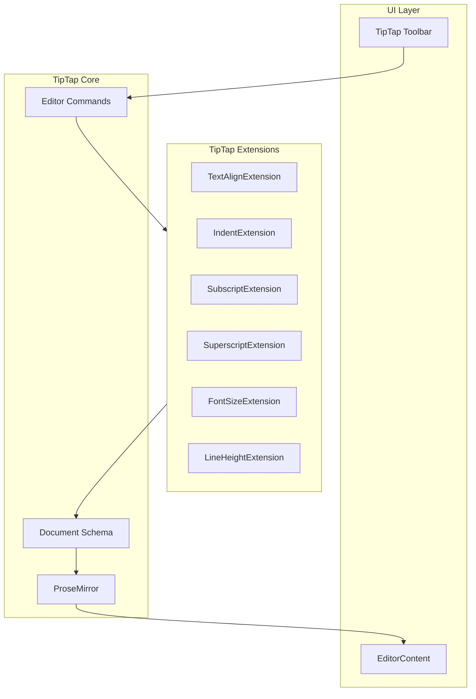

# Product Requirements Document
# PRD-WIKI-007: Word-Style Rich Text Formatting Toolbar

| Field | Value |
|-------|-------|
| **Document ID** | PRD-WIKI-007 |
| **Version** | 1.0 |
| **Status** | Approved & Implemented |
| **Author** | Architecture Team |
| **Created** | December 2024 |
| **Last Updated** | December 2024 |
| **Epic** | EPIC-WIKI-007 |

---

## 1. Executive Summary

This PRD defines the requirements for implementing a Microsoft Word-style rich text formatting toolbar in the ARKHITEKTON Knowledge Core (Wiki) module. The goal is to provide enterprise users with familiar document authoring controls that match their expectations from desktop applications like Microsoft Word.

---

## 2. Feature Vision

Transform the ARKHITEKTON wiki editor into a **professional-grade document authoring experience** that matches the familiarity and power of Microsoft Word.

### Vision Statement
> "Enterprise architects and technical writers should feel immediately at home when creating documentation in ARKHITEKTON, with formatting controls that work exactly as they expect from years of using desktop word processors."

### Success Metrics
| Metric | Target | Measurement |
|--------|--------|-------------|
| Feature Parity | 95% of Word's core formatting | Feature checklist |
| User Adoption | 80% of wiki users use new controls | Analytics |
| Productivity | 30% faster document formatting | Time-on-task study |
| Satisfaction | 4.5/5 user rating | User surveys |

---

## 3. Feature Strategy

### 3.1 Strategic Approach

```mermaid
flowchart LR
    subgraph Phase1 [Phase 1: Core Formatting]
        A1[Text Alignment]
        A2[Indent/Outdent]
        A3[Sub/Superscript]
    end
    
    subgraph Phase2 [Phase 2: Advanced Controls]
        B1[Change Case]
        B2[Clear Formatting]
        B3[Highlight Colors]
    end
    
    subgraph Phase3 [Phase 3: Productivity]
        C1[Format Painter]
        C2[Style Presets]
        C3[Font Size Dropdown]
    end
    
    subgraph Phase4 [Phase 4: Future]
        D1[Tables]
        D2[Columns]
        D3[Section Breaks]
    end
    
    Phase1 --> Phase2 --> Phase3 --> Phase4
```



### 3.2 Implementation Phases

| Phase | Scope | Sprint | Status |
|-------|-------|--------|--------|
| Phase 1 | Core Formatting (Alignment, Indent, Sub/Super) | Sprint 1 | Complete |
| Phase 2 | Advanced Controls (Case, Clear, Highlight) | Sprint 1 | Complete |
| Phase 3 | Productivity (Format Painter, Styles, Font Size) | Sprint 1 | Complete |
| Phase 4 | Tables, Columns, Advanced Layout | Future | Planned |

### 3.3 Technical Strategy

- **Framework**: TipTap (ProseMirror-based) rich text editor
- **Extension Pattern**: Create modular TipTap extensions for each feature
- **UI Components**: Shadcn/UI components for toolbar controls
- **Styling**: Tailwind CSS with ARKHITEKTON design system

---

## 4. Gap Analysis: Current State vs. Target State

### 4.1 Feature Comparison Matrix

| Feature | Microsoft Word | Current Wiki | Gap | Priority |
|---------|---------------|--------------|-----|----------|
| **Font Family** | Dropdown | Dropdown | None | - |
| **Font Size** | Dropdown + A↑/A↓ | +/- only | Partial | High |
| **Bold/Italic/Underline** | Yes | Yes | None | - |
| **Strikethrough** | Yes | Yes | None | - |
| **Subscript** | Yes | No | Missing | Medium |
| **Superscript** | Yes | No | Missing | Medium |
| **Text Color** | Picker | Picker | None | - |
| **Highlight Color** | Multi-color | Toggle only | Partial | Medium |
| **Change Case (Aa)** | Yes | No | Missing | Medium |
| **Clear Formatting** | Yes | No | Missing | High |
| **Text Alignment** | L/C/R/J | No | Missing | High |
| **Bullets/Numbering** | Yes | Yes | None | - |
| **Indent/Outdent** | Yes | No | Missing | High |
| **Line Spacing** | Yes | Yes | None | - |
| **Style Presets** | Yes | Headings only | Partial | Medium |
| **Format Painter** | Yes | No | Missing | High |

### 4.2 Gap Summary

- **Missing Features**: 7 (Subscript, Superscript, Change Case, Clear Formatting, Alignment, Indent, Format Painter)
- **Partial Features**: 3 (Font Size, Highlight, Style Presets)
- **Complete Features**: 6 (Font Family, Bold/Italic/Underline, Strike, Text Color, Lists, Line Spacing)

---

## 5. High-Level Requirements (HLRs)

### 5.1 HLR Summary Table

| HLR ID | Requirement | Priority | Category |
|--------|-------------|----------|----------|
| HLR-WIKI-RTF-001 | Text Alignment Controls | High | Formatting |
| HLR-WIKI-RTF-002 | Paragraph Indentation | High | Formatting |
| HLR-WIKI-RTF-003 | Subscript Formatting | Medium | Text Marks |
| HLR-WIKI-RTF-004 | Superscript Formatting | Medium | Text Marks |
| HLR-WIKI-RTF-005 | Change Text Case | Medium | Text Transform |
| HLR-WIKI-RTF-006 | Clear All Formatting | High | Utility |
| HLR-WIKI-RTF-007 | Highlight Color Picker | Medium | Text Marks |
| HLR-WIKI-RTF-008 | Font Size Dropdown | High | Typography |
| HLR-WIKI-RTF-009 | Format Painter | High | Productivity |
| HLR-WIKI-RTF-010 | Style Presets | Medium | Productivity |

### 5.2 HLR Specifications

#### HLR-WIKI-RTF-001: Text Alignment Controls

| Field | Value |
|-------|-------|
| **ID** | HLR-WIKI-RTF-001 |
| **Title** | Text Alignment Controls |
| **Priority** | High |
| **Category** | Paragraph Formatting |

**Description:**
The system shall provide paragraph alignment controls allowing users to align text left, center, right, or justified within the wiki editor.

**Functional Requirements:**
- FR-001.1: Display four alignment buttons in the toolbar (Left, Center, Right, Justify)
- FR-001.2: Apply alignment to current paragraph or selected paragraphs
- FR-001.3: Persist alignment in saved document content
- FR-001.4: Support keyboard shortcuts for each alignment option
- FR-001.5: Show active alignment state visually on toolbar buttons

**Keyboard Shortcuts:**
| Action | Shortcut |
|--------|----------|
| Left Align | Ctrl+Shift+L |
| Center | Ctrl+Shift+E |
| Right Align | Ctrl+Shift+R |
| Justify | Ctrl+Shift+J |

---

#### HLR-WIKI-RTF-002: Paragraph Indentation

| Field | Value |
|-------|-------|
| **ID** | HLR-WIKI-RTF-002 |
| **Title** | Paragraph Indentation Controls |
| **Priority** | High |
| **Category** | Paragraph Formatting |

**Description:**
The system shall provide paragraph indentation controls allowing users to increase or decrease the left margin of paragraphs.

**Functional Requirements:**
- FR-002.1: Display Indent and Outdent buttons in the toolbar
- FR-002.2: Support up to 10 levels of indentation
- FR-002.3: Each indent level adds 24 pixels of left margin
- FR-002.4: Prevent outdent below level 0
- FR-002.5: Support Tab and Shift+Tab keyboard shortcuts

**Configuration:**
| Parameter | Value |
|-----------|-------|
| Minimum Indent | 0 |
| Maximum Indent | 10 levels |
| Indent Unit | 24px per level |

---

#### HLR-WIKI-RTF-003: Subscript Formatting

| Field | Value |
|-------|-------|
| **ID** | HLR-WIKI-RTF-003 |
| **Title** | Subscript Text Formatting |
| **Priority** | Medium |
| **Category** | Text Marks |

**Description:**
The system shall allow users to format selected text as subscript for scientific notation (e.g., H₂O).

**Functional Requirements:**
- FR-003.1: Display Subscript toggle button in text formatting section
- FR-003.2: Render subscript text using HTML `<sub>` element
- FR-003.3: Support Ctrl+, keyboard shortcut
- FR-003.4: Subscript and superscript are mutually exclusive

---

#### HLR-WIKI-RTF-004: Superscript Formatting

| Field | Value |
|-------|-------|
| **ID** | HLR-WIKI-RTF-004 |
| **Title** | Superscript Text Formatting |
| **Priority** | Medium |
| **Category** | Text Marks |

**Description:**
The system shall allow users to format selected text as superscript for exponents and trademark symbols (e.g., x², ™).

**Functional Requirements:**
- FR-004.1: Display Superscript toggle button in text formatting section
- FR-004.2: Render superscript text using HTML `<sup>` element
- FR-004.3: Support Ctrl+. keyboard shortcut
- FR-004.4: Superscript and subscript are mutually exclusive

---

#### HLR-WIKI-RTF-005: Change Text Case

| Field | Value |
|-------|-------|
| **ID** | HLR-WIKI-RTF-005 |
| **Title** | Change Text Case |
| **Priority** | Medium |
| **Category** | Text Transformation |

**Description:**
The system shall provide a dropdown menu to change the case of selected text without retyping.

**Functional Requirements:**
- FR-005.1: Display Change Case dropdown in toolbar
- FR-005.2: Support UPPERCASE transformation
- FR-005.3: Support lowercase transformation
- FR-005.4: Support Title Case transformation
- FR-005.5: Support Sentence case transformation
- FR-005.6: Preserve existing formatting marks after case change

**Case Transformations:**
| Type | Example Input | Example Output |
|------|---------------|----------------|
| UPPERCASE | hello world | HELLO WORLD |
| lowercase | HELLO WORLD | hello world |
| Title Case | hello world | Hello World |
| Sentence case | HELLO WORLD | Hello world |

---

#### HLR-WIKI-RTF-006: Clear All Formatting

| Field | Value |
|-------|-------|
| **ID** | HLR-WIKI-RTF-006 |
| **Title** | Clear All Formatting |
| **Priority** | High |
| **Category** | Utility |

**Description:**
The system shall provide a button to remove all formatting from selected text, returning it to default styling.

**Functional Requirements:**
- FR-006.1: Display Clear Formatting button in toolbar
- FR-006.2: Remove all text marks (bold, italic, underline, strike, highlight)
- FR-006.3: Reset text style attributes (font size, font family, color)
- FR-006.4: Reset paragraph attributes (alignment, indentation)
- FR-006.5: Maintain text content (only formatting is removed)

---

#### HLR-WIKI-RTF-007: Highlight Color Picker

| Field | Value |
|-------|-------|
| **ID** | HLR-WIKI-RTF-007 |
| **Title** | Highlight Color Picker |
| **Priority** | Medium |
| **Category** | Text Marks |

**Description:**
The system shall provide a color picker for text highlighting with multiple color options.

**Functional Requirements:**
- FR-007.1: Display Highlight button with color indicator
- FR-007.2: Open color picker popover on click
- FR-007.3: Provide 8 highlight color options
- FR-007.4: Include "Remove Highlight" option
- FR-007.5: Show selected color with ring indicator

**Color Palette:**
| Color | Hex Code |
|-------|----------|
| Yellow | #fef08a |
| Green | #bbf7d0 |
| Blue | #bfdbfe |
| Pink | #fbcfe8 |
| Orange | #fed7aa |
| Purple | #e9d5ff |
| Red | #fecaca |
| Cyan | #a5f3fc |

---

#### HLR-WIKI-RTF-008: Font Size Dropdown

| Field | Value |
|-------|-------|
| **ID** | HLR-WIKI-RTF-008 |
| **Title** | Font Size Dropdown with Increment Controls |
| **Priority** | High |
| **Category** | Typography |

**Description:**
The system shall provide a font size dropdown combined with increment/decrement buttons for precise text sizing.

**Functional Requirements:**
- FR-008.1: Display font size dropdown showing current size
- FR-008.2: Display - button to decrease size by 1px
- FR-008.3: Display + button to increase size by 1px
- FR-008.4: Provide standard font sizes in dropdown
- FR-008.5: Enforce minimum size of 8px
- FR-008.6: Enforce maximum size of 72px

**Standard Sizes:**
8, 9, 10, 11, 12, 14, 16, 18, 20, 24, 28, 32, 36, 48, 72

---

#### HLR-WIKI-RTF-009: Format Painter

| Field | Value |
|-------|-------|
| **ID** | HLR-WIKI-RTF-009 |
| **Title** | Format Painter |
| **Priority** | High |
| **Category** | Productivity |

**Description:**
The system shall provide a format painter tool that copies formatting from one text selection and applies it to another.

**Functional Requirements:**
- FR-009.1: Display Format Painter button in toolbar
- FR-009.2: Copy all text marks from current selection when activated
- FR-009.3: Copy text style attributes (font size, family, color)
- FR-009.4: Apply stored formatting to next text selection
- FR-009.5: Deactivate automatically after applying format
- FR-009.6: Allow manual deactivation by clicking button again
- FR-009.7: Show distinctive visual state when active

**Stored Format Properties:**
- Bold, Italic, Underline, Strike
- Highlight (with color)
- Subscript, Superscript
- Font Size, Font Family
- Text Color

---

#### HLR-WIKI-RTF-010: Style Presets

| Field | Value |
|-------|-------|
| **ID** | HLR-WIKI-RTF-010 |
| **Title** | Style Presets Dropdown |
| **Priority** | Medium |
| **Category** | Productivity |

**Description:**
The system shall provide predefined style presets for quick, consistent text formatting.

**Functional Requirements:**
- FR-010.1: Display Styles dropdown in toolbar
- FR-010.2: Show styled preview of each preset in menu
- FR-010.3: Clear existing formatting before applying preset
- FR-010.4: Apply all preset attributes in single action

**Style Presets:**
| Preset | Font Size | Weight | Color | Other |
|--------|-----------|--------|-------|-------|
| Normal | 16px | normal | default | - |
| Title | 28px | bold | default | - |
| Heading 1 | 24px | bold | default | - |
| Heading 2 | 20px | bold | default | - |
| Subtitle | 14px | normal | #666666 | - |
| Quote | 14px | normal | #666666 | italic |
| Code | 13px | normal | #d63384 | Courier New |

---

## 6. Technical Architecture

### 6.1 Component Architecture



### 6.2 Extension Files

| Extension | File Path | Type |
|-----------|-----------|------|
| TextAlign | `extensions/text-align.ts` | Global Attribute |
| Indent | `extensions/indent.ts` | Global Attribute |
| Subscript | `extensions/subscript.ts` | Mark |
| Superscript | `extensions/superscript.ts` | Mark |
| FontSize | `extensions/font-size.ts` | Text Style |
| LineHeight | `extensions/line-height.ts` | Global Attribute |

### 6.3 Toolbar Organization

```
┌─────────────────────────────────────────────────────────────────────────────────────┐
│ Toolbar                                                                              │
├─────┬─────┬───────────────┬─────────┬───────┬───────────────────┬─────────┬─────────┤
│Undo │Redo │ Format Painter│ Styles  │ Case  │ Font Family       │ -│Size│+ │ Color │
├─────┴─────┴───────────────┴─────────┴───────┴───────────────────┴─────────┴─────────┤
│ B │ I │ U │ S │ Highlight │ Code │ Sub │ Sup │ Left│Center│Right│Just │ ←Indent→  │
├─────────────────────────────────────────────────────────────────────────────────────┤
│ ¶ │ H1 │ H2 │ H3 │ • │ 1. │ ☐ │ ❝ │ </> │ ─ │ Link │ Image                       │
└─────────────────────────────────────────────────────────────────────────────────────┘
```

---

## 7. Low-Level Requirements (Gherkin Specifications)

### 7.1 Text Alignment

```gherkin
Feature: Text Alignment Controls
  As a wiki author
  I want to align text left, center, right, or justified
  So that I can create professionally formatted documents

  Background:
    Given I am editing a wiki page
    And the formatting toolbar is visible

  @alignment @toolbar
  Scenario: Display alignment buttons in toolbar
    When I look at the formatting toolbar
    Then I should see Left Align button with AlignLeft icon
    And I should see Center Align button with AlignCenter icon
    And I should see Right Align button with AlignRight icon
    And I should see Justify button with AlignJustify icon

  @alignment @left
  Scenario: Left align paragraph
    Given I have cursor in a paragraph
    When I click the Left Align button
    Then the paragraph should have style "text-align: left"
    And the Left Align button should appear pressed/active

  @alignment @center
  Scenario: Center align paragraph
    Given I have cursor in a paragraph
    When I click the Center Align button
    Then the paragraph should have style "text-align: center"
    And the Center Align button should appear pressed/active

  @alignment @right
  Scenario: Right align paragraph
    Given I have cursor in a paragraph
    When I click the Right Align button
    Then the paragraph should have style "text-align: right"
    And the Right Align button should appear pressed/active

  @alignment @justify
  Scenario: Justify paragraph
    Given I have cursor in a paragraph
    When I click the Justify button
    Then the paragraph should have style "text-align: justify"
    And the Justify button should appear pressed/active

  @alignment @keyboard
  Scenario Outline: Keyboard shortcuts for alignment
    Given I have cursor in a paragraph
    When I press "<shortcut>"
    Then the paragraph should have style "text-align: <alignment>"

    Examples:
      | shortcut       | alignment |
      | Ctrl+Shift+L   | left      |
      | Ctrl+Shift+E   | center    |
      | Ctrl+Shift+R   | right     |
      | Ctrl+Shift+J   | justify   |

  @alignment @persistence
  Scenario: Alignment persists on save
    Given I have centered a paragraph
    When I save the wiki page
    And I reload the page
    Then the paragraph should still be centered
```

### 7.2 Paragraph Indentation

```gherkin
Feature: Paragraph Indentation Controls
  As a wiki author
  I want to indent and outdent paragraphs
  So that I can create visual hierarchy in my documents

  Background:
    Given I am editing a wiki page
    And the formatting toolbar is visible

  @indent @toolbar
  Scenario: Display indent buttons in toolbar
    When I look at the formatting toolbar
    Then I should see an Increase Indent button with Indent icon
    And I should see a Decrease Indent button with Outdent icon

  @indent @increase
  Scenario: Increase paragraph indent
    Given I have cursor in a paragraph with no indent
    When I click the Increase Indent button
    Then the paragraph should have style "margin-left: 24px"
    And the indent level should be 1

  @indent @multiple
  Scenario: Multiple indent levels
    Given I have cursor in a paragraph with indent level 1
    When I click the Increase Indent button
    Then the paragraph should have style "margin-left: 48px"
    And the indent level should be 2

  @indent @maximum
  Scenario: Maximum indent level
    Given I have cursor in a paragraph with indent level 10
    When I click the Increase Indent button
    Then the indent level should remain at 10
    And the margin-left should remain at 240px

  @indent @decrease
  Scenario: Decrease paragraph indent
    Given I have cursor in a paragraph with indent level 2
    When I click the Decrease Indent button
    Then the paragraph should have style "margin-left: 24px"
    And the indent level should be 1

  @indent @minimum
  Scenario: Cannot outdent below zero
    Given I have cursor in a paragraph with no indent
    When I click the Decrease Indent button
    Then the indent level should remain at 0
    And the paragraph should have no margin-left

  @indent @keyboard
  Scenario: Tab key indents paragraph
    Given I have cursor in a paragraph
    When I press "Tab"
    Then the paragraph indent should increase by 1 level

  @indent @keyboard
  Scenario: Shift+Tab outdents paragraph
    Given I have cursor in a paragraph with indent level 1
    When I press "Shift+Tab"
    Then the paragraph indent should decrease by 1 level
```

### 7.3 Subscript and Superscript

```gherkin
Feature: Subscript and Superscript Text Formatting
  As a wiki author documenting technical content
  I want to format text as subscript or superscript
  So that I can write chemical formulas and exponents correctly

  Background:
    Given I am editing a wiki page
    And the formatting toolbar is visible

  @subscript @toolbar
  Scenario: Display subscript button in toolbar
    When I look at the text formatting section
    Then I should see a Subscript button with Subscript icon
    And hovering should show tooltip "Subscript (Ctrl+,)"

  @subscript @apply
  Scenario: Apply subscript to selected text
    Given I have typed "H2O"
    And I select the character "2"
    When I click the Subscript button
    Then the "2" should be wrapped in <sub> element
    And the Subscript button should appear pressed/active

  @subscript @toggle
  Scenario: Toggle subscript off
    Given I have subscript text "<sub>2</sub>" selected
    When I click the Subscript button
    Then the text should return to normal baseline
    And the Subscript button should no longer be pressed

  @subscript @keyboard
  Scenario: Keyboard shortcut for subscript
    Given I have text selected
    When I press "Ctrl+,"
    Then the selected text should toggle subscript formatting

  @superscript @toolbar
  Scenario: Display superscript button in toolbar
    When I look at the text formatting section
    Then I should see a Superscript button with Superscript icon
    And hovering should show tooltip "Superscript (Ctrl+.)"

  @superscript @apply
  Scenario: Apply superscript to selected text
    Given I have typed "x2"
    And I select the character "2"
    When I click the Superscript button
    Then the "2" should be wrapped in <sup> element
    And the Superscript button should appear pressed/active

  @superscript @keyboard
  Scenario: Keyboard shortcut for superscript
    Given I have text selected
    When I press "Ctrl+."
    Then the selected text should toggle superscript formatting

  @mutual-exclusion
  Scenario: Subscript and superscript are mutually exclusive
    Given I have superscript text selected
    When I apply subscript
    Then the superscript should be removed
    And the text should become subscript
```

### 7.4 Change Text Case

```gherkin
Feature: Change Text Case
  As a wiki author
  I want to quickly change the case of selected text
  So that I can fix capitalization errors without retyping

  Background:
    Given I am editing a wiki page
    And the formatting toolbar is visible

  @case @toolbar
  Scenario: Display change case dropdown in toolbar
    When I look at the formatting toolbar
    Then I should see a Change Case dropdown button
    And it should display the CaseSensitive icon

  @case @menu
  Scenario: Open change case menu
    When I click the Change Case dropdown
    Then I should see the following options:
      | Option         |
      | UPPERCASE      |
      | lowercase      |
      | Title Case     |
      | Sentence case  |

  @case @uppercase
  Scenario: Convert to uppercase
    Given I have selected the text "hello world"
    When I click Change Case > UPPERCASE
    Then the text should become "HELLO WORLD"

  @case @lowercase
  Scenario: Convert to lowercase
    Given I have selected the text "HELLO WORLD"
    When I click Change Case > lowercase
    Then the text should become "hello world"

  @case @title
  Scenario: Convert to title case
    Given I have selected the text "hello world example"
    When I click Change Case > Title Case
    Then the text should become "Hello World Example"

  @case @sentence
  Scenario: Convert to sentence case
    Given I have selected the text "HELLO WORLD EXAMPLE"
    When I click Change Case > Sentence case
    Then the text should become "Hello world example"

  @case @no-selection
  Scenario: No selection shows no effect
    Given I have no text selected
    When I click Change Case > UPPERCASE
    Then nothing should change

  @case @preserve-formatting
  Scenario: Case change preserves formatting
    Given I have bold italic text "hello world" selected
    When I click Change Case > UPPERCASE
    Then the text should become bold italic "HELLO WORLD"
```

### 7.5 Clear Formatting

```gherkin
Feature: Clear All Formatting
  As a wiki author
  I want to quickly remove all formatting from selected text
  So that I can start fresh or clean up pasted content

  Background:
    Given I am editing a wiki page
    And the formatting toolbar is visible

  @clear @toolbar
  Scenario: Display clear formatting button in toolbar
    When I look at the formatting toolbar
    Then I should see a Clear Formatting button
    And it should display the RemoveFormatting icon

  @clear @marks
  Scenario: Clear formatting removes all marks
    Given I have selected text with the following formatting:
      | Format     |
      | Bold       |
      | Italic     |
      | Underline  |
      | Strike     |
      | Highlight  |
    When I click the Clear Formatting button
    Then all marks should be removed
    And the text should be plain/unstyled

  @clear @styles
  Scenario: Clear formatting removes text styles
    Given I have selected text with:
      | Style       | Value        |
      | Font Size   | 24px         |
      | Font Family | Georgia      |
      | Text Color  | #ff0000      |
    When I click the Clear Formatting button
    Then the text should reset to default font size
    And the text should reset to default font family
    And the text should reset to default color

  @clear @alignment
  Scenario: Clear formatting removes alignment
    Given I have a centered paragraph selected
    When I click the Clear Formatting button
    Then the paragraph should reset to left alignment

  @clear @indent
  Scenario: Clear formatting removes indentation
    Given I have a paragraph with indent level 3 selected
    When I click the Clear Formatting button
    Then the paragraph should reset to no indentation
```

### 7.6 Highlight Color Picker

```gherkin
Feature: Highlight Color Picker
  As a wiki author
  I want to highlight text with different colors
  So that I can visually categorize information

  Background:
    Given I am editing a wiki page
    And the formatting toolbar is visible

  @highlight @toolbar
  Scenario: Display highlight color picker in toolbar
    When I look at the formatting toolbar
    Then I should see a Highlight button with color indicator
    And the indicator should show the current highlight color

  @highlight @popover
  Scenario: Open highlight color picker
    When I click the Highlight button
    Then a popover should open
    And I should see 8 highlight color options:
      | Color  | Hex     |
      | Yellow | #fef08a |
      | Green  | #bbf7d0 |
      | Blue   | #bfdbfe |
      | Pink   | #fbcfe8 |
      | Orange | #fed7aa |
      | Purple | #e9d5ff |
      | Red    | #fecaca |
      | Cyan   | #a5f3fc |
    And I should see a "Remove Highlight" button

  @highlight @apply
  Scenario: Apply highlight color to text
    Given I have text selected
    When I open the Highlight picker
    And I click the Yellow color
    Then the selected text should have background-color "#fef08a"
    And the picker should close

  @highlight @change
  Scenario: Change highlight color
    Given I have yellow-highlighted text selected
    When I open the Highlight picker
    And I click the Blue color
    Then the highlight should change to "#bfdbfe"

  @highlight @remove
  Scenario: Remove highlight
    Given I have highlighted text selected
    When I open the Highlight picker
    And I click "Remove Highlight"
    Then the highlight should be removed
    And the text should have no background color

  @highlight @indicator
  Scenario: Selected color shows ring indicator
    Given I have text with blue highlight selected
    When I open the Highlight picker
    Then the Blue color button should show a ring/border indicator
```

### 7.7 Font Size Controls

```gherkin
Feature: Font Size Dropdown with Increment Controls
  As a wiki author
  I want to select font sizes from a dropdown or use increment buttons
  So that I can precisely control text sizing

  Background:
    Given I am editing a wiki page
    And the formatting toolbar is visible

  @font-size @toolbar
  Scenario: Display font size controls in toolbar
    When I look at the formatting toolbar
    Then I should see a "-" decrease button
    And I should see a font size dropdown showing current size
    And I should see a "+" increase button

  @font-size @dropdown
  Scenario: Open font size dropdown
    When I click the font size dropdown
    Then I should see a scrollable list of sizes:
      | 8 | 9 | 10 | 11 | 12 | 14 | 16 | 18 | 20 | 24 | 28 | 32 | 36 | 48 | 72 |

  @font-size @select
  Scenario: Select font size from dropdown
    Given I have text selected
    When I open the font size dropdown
    And I click "24"
    Then the selected text should have font-size "24px"
    And the dropdown should show "24"

  @font-size @increase
  Scenario: Increase font size with button
    Given I have text at size 16 selected
    When I click the "+" button
    Then the text font-size should become "17px"
    And the dropdown should show "17"

  @font-size @decrease
  Scenario: Decrease font size with button
    Given I have text at size 16 selected
    When I click the "-" button
    Then the text font-size should become "15px"
    And the dropdown should show "15"

  @font-size @minimum
  Scenario: Minimum font size limit
    Given I have text at size 8 selected
    When I click the "-" button
    Then the text font-size should remain "8px"

  @font-size @maximum
  Scenario: Maximum font size limit
    Given I have text at size 72 selected
    When I click the "+" button
    Then the text font-size should remain "72px"
```

### 7.8 Format Painter

```gherkin
Feature: Format Painter
  As a wiki author
  I want to copy formatting from one text selection and apply it to another
  So that I can maintain consistent styling throughout my document

  Background:
    Given I am editing a wiki page
    And the formatting toolbar is visible

  @format-painter @toolbar
  Scenario: Display format painter button in toolbar
    When I look at the formatting toolbar
    Then I should see a Format Painter button with Paintbrush icon
    And it should appear in normal/unpressed state

  @format-painter @activate
  Scenario: Activate format painter
    Given I have styled text selected with:
      | Property   | Value    |
      | bold       | true     |
      | italic     | true     |
      | color      | #ff0000  |
      | fontSize   | 18px     |
    When I click the Format Painter button
    Then the button should become active/pressed
    And the button should have primary color styling
    And the format should be stored

  @format-painter @apply
  Scenario: Apply copied format to new selection
    Given the format painter is active with stored formatting
    When I select different text
    Then the stored formatting should be applied to the new text
    And the format painter should deactivate
    And the button should return to normal state

  @format-painter @cancel
  Scenario: Cancel format painter
    Given the format painter is active
    When I click the Format Painter button again
    Then the format painter should deactivate
    And no formatting should be applied
    And the stored format should be cleared

  @format-painter @all-marks
  Scenario: Format painter copies all marks
    Given I have text with:
      | Mark        |
      | Bold        |
      | Italic      |
      | Underline   |
      | Strike      |
      | Highlight   |
      | Subscript   |
    When I activate format painter
    Then all marks should be stored for application
```

### 7.9 Style Presets

```gherkin
Feature: Style Presets Dropdown
  As a wiki author
  I want to apply predefined style presets
  So that I can quickly format text consistently

  Background:
    Given I am editing a wiki page
    And the formatting toolbar is visible

  @styles @toolbar
  Scenario: Display style presets dropdown in toolbar
    When I look at the formatting toolbar
    Then I should see a "Styles" dropdown button
    And it should have a Sparkles icon

  @styles @menu
  Scenario: Open style presets menu
    When I click the Styles dropdown
    Then I should see the following presets:
      | Preset     |
      | Normal     |
      | Title      |
      | Heading 1  |
      | Heading 2  |
      | Subtitle   |
      | Quote      |
      | Code       |

  @styles @preview
  Scenario: Preset menu shows styled previews
    When I open the Styles dropdown
    Then each menu item should display in its own style
    And users can visually preview the style

  @styles @normal
  Scenario: Apply Normal style
    Given I have formatted text selected
    When I click Styles > Normal
    Then the text should reset to 16px
    And the text should reset to normal weight
    And previous formatting should be cleared

  @styles @title
  Scenario: Apply Title style
    Given I have text selected
    When I click Styles > Title
    Then the text should become 28px bold

  @styles @quote
  Scenario: Apply Quote style
    Given I have text selected
    When I click Styles > Quote
    Then the text should become 14px
    And the text should be gray color
    And the text should be italic

  @styles @code
  Scenario: Apply Code style
    Given I have text selected
    When I click Styles > Code
    Then the text should become 13px
    And the text should use "Courier New" font
    And the text should have pink/magenta color (#d63384)
```

---

## 8. Traceability Matrix

| HLR ID | User Story | Extension | Toolbar Section | Test Scenario |
|--------|------------|-----------|-----------------|---------------|
| HLR-WIKI-RTF-001 | US-WIKI-RTF-001 | text-align.ts | Alignment | 7.1 |
| HLR-WIKI-RTF-002 | US-WIKI-RTF-002 | indent.ts | Indentation | 7.2 |
| HLR-WIKI-RTF-003 | US-WIKI-RTF-003 | subscript.ts | Text Formatting | 7.3 |
| HLR-WIKI-RTF-004 | US-WIKI-RTF-004 | superscript.ts | Text Formatting | 7.3 |
| HLR-WIKI-RTF-005 | US-WIKI-RTF-005 | - (function) | Change Case | 7.4 |
| HLR-WIKI-RTF-006 | US-WIKI-RTF-006 | - (function) | Format Painter | 7.5 |
| HLR-WIKI-RTF-007 | US-WIKI-RTF-007 | highlight (config) | Text Formatting | 7.6 |
| HLR-WIKI-RTF-008 | US-WIKI-RTF-008 | font-size.ts | Font Size | 7.7 |
| HLR-WIKI-RTF-009 | US-WIKI-RTF-009 | - (state) | Format Painter | 7.8 |
| HLR-WIKI-RTF-010 | US-WIKI-RTF-010 | - (constant) | Style Presets | 7.9 |

---

## 9. Implementation Summary

### 9.1 Files Created

| File | Type | Purpose |
|------|------|---------|
| `extensions/text-align.ts` | Extension | Paragraph alignment |
| `extensions/indent.ts` | Extension | Paragraph indentation |
| `extensions/subscript.ts` | Mark | Subscript text |
| `extensions/superscript.ts` | Mark | Superscript text |
| `extensions/index.ts` | Index | Export all extensions |
| `tiptap-editor.tsx` | Component | Updated with new controls |

### 9.2 Story Points Summary

| Category | Stories | Points |
|----------|---------|--------|
| Feature Stories | 10 | 43 |
| Implementation Stories | 4 | 15 |
| **Total** | **14** | **58** |

### 9.3 Keyboard Shortcuts

| Action | Shortcut |
|--------|----------|
| Left Align | Ctrl+Shift+L |
| Center Align | Ctrl+Shift+E |
| Right Align | Ctrl+Shift+R |
| Justify | Ctrl+Shift+J |
| Indent | Tab |
| Outdent | Shift+Tab |
| Subscript | Ctrl+, |
| Superscript | Ctrl+. |

---

## 10. Appendices

### Appendix A: Microsoft Word Toolbar Reference

The implementation is based on the Microsoft Word Home ribbon toolbar, specifically:
- Font group (Font family, size, bold, italic, underline, strikethrough, subscript, superscript, text effects, highlight, font color)
- Paragraph group (Bullets, numbering, multilevel list, decrease/increase indent, sort, show/hide, align left/center/right/justify, line spacing, shading, borders)
- Styles group (Quick styles gallery, change styles)
- Editing group (Find, replace, select)

### Appendix B: Related Documents

| Document | ID | Description |
|----------|-----|-------------|
| User Stories | US-WIKI-RTF-* | Detailed user stories with Gherkin |
| Technical Spec | TDS-WIKI-007 | Technical design specification |
| Test Plan | TP-WIKI-007 | Test plan and scenarios |

---

*Document End*

