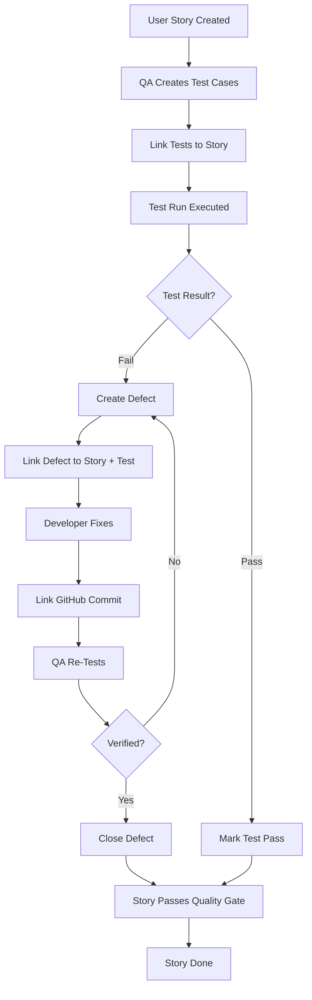

# Quality Center — Product Overview

**Version:** 1.0  
**Date:** December 24, 2025  
**Module:** Quality Center  
**Purpose:** Comprehensive Testing Lifecycle Management

---

## Executive Summary

The **Arkhitekton Quality Center** is a comprehensive quality management platform that enables teams to manage the complete testing lifecycle—from defect tracking and test planning to execution and reporting. It provides end-to-end traceability between requirements, test cases, defects, and user stories, ensuring quality is measurable, trackable, and continuously improving.

**Key Value Proposition:**
- **Unified Quality Hub**: Single source of truth for all quality-related activities
- **Full Lifecycle Coverage**: From test planning through execution to defect resolution
- **Traceability**: Bi-directional links between stories, tests, and defects
- **Data-Driven Decisions**: Real-time metrics and dashboards for quality insights
- **Integration-Ready**: GitHub and Jira integration for seamless workflows

---

## Module Navigation Structure

```
Quality Center (Left Navigation)
├── Dashboard          → Quality command center with key metrics
├── Defects            → Defect tracking and management
├── Test Plan          → Test suite organization and execution
└── Reports            → Test coverage and quality analytics
```

---

## Core Features & User Workflows

### 1. **Quality Dashboard** — Command Center

**What It Does:**
The Quality Dashboard provides a real-time, at-a-glance view of your quality posture across the entire platform.

**Key Metrics:**
- **Total Defects**: Overall count of all defects in the system
- **Open Defects**: Active defects requiring attention
- **In-Progress Defects**: Defects currently being worked on
- **Resolved Defects**: Completed defect fixes
- **Resolution Rate**: Percentage of defects resolved (KPI)
- **Critical & High Severity Alerts**: Red-flag defects requiring immediate action

**Visual Components:**
- **Severity Distribution Chart**: See defect breakdown by severity (Critical/High/Medium/Low)
- **Status Breakdown**: Visual representation of defect workflow states
- **Recent Defects List**: Last 5 defects created with quick-view details
- **Trend Indicators**: Up/down arrows showing quality trajectory

**User Actions:**
- Click "View All Defects" → Navigate to full defect list
- Click "View Reports" → Access detailed analytics
- Click individual defect → Jump to defect detail page
- Monitor critical defects at a glance

**Best For:**
- **QA Managers**: Daily standup metrics
- **Product Owners**: Release readiness assessment
- **Executives**: High-level quality health check

---

### 2. **Defect Management** — Full Defect Lifecycle

#### 2.1 **Defect List View**

**What It Does:**
Centralized view of all defects with powerful filtering, search, and bulk operations.

**Features:**
- **Advanced Search**: Full-text search across titles and descriptions
- **Multi-Dimensional Filters**:
  - **Status**: Open, In-Progress, Resolved, Closed, Rejected
  - **Severity**: Critical, High, Medium, Low
  - **Module/Component**: Filter by affected system area
  - **Story Filter**: View defects linked to specific user story
- **Sortable Columns**: 
  - Defect ID
  - Title
  - Severity
  - Status
  - Linked User Story
  - Created Date
  - Assignee
- **Bulk Actions**: Select multiple defects for batch updates
- **Export**: CSV/Excel export for reporting

**Visual Indicators:**
- **Severity Badges**: Color-coded (Red=Critical, Orange=High, Yellow=Medium, Blue=Low)
- **Status Icons**: Visual workflow state (Alert=Open, Clock=In-Progress, Check=Resolved)
- **Age Indicators**: How long defect has been open

**User Workflows:**

**Scenario 1: QA Engineer Finding Critical Defects**
```
1. Navigate to Quality Center → Defects
2. Apply filters: Status=Open, Severity=Critical
3. Sort by Created Date (oldest first)
4. Review defects requiring immediate attention
5. Click defect → Navigate to detail page for triage
```

**Scenario 2: Developer Finding Assigned Defects**
```
1. Navigate to Defects
2. Apply filter: Assigned To=<My Name>
3. Filter Status=In-Progress
4. Work through assigned defects
5. Update status as fixes are completed
```

**Scenario 3: Product Owner Pre-Release Quality Check**
```
1. Navigate to Defects
2. Filter: Severity=Critical OR High, Status ≠ Resolved
3. Assess blockers before release
4. Export list for stakeholder review
```

#### 2.2 **Defect Detail View**

**What It Does:**
Comprehensive defect record with full context, history, and collaboration features.

**Information Displayed:**

**Header Section:**
- **Defect ID**: Unique identifier (e.g., DEF-QC-001, DEF-REF-015)
- **Title**: Short description
- **Status Badge**: Current workflow state
- **Severity Badge**: Priority level
- **Type Badge**: Bug, Regression, Performance, Security, Usability

**Description Section:**
- **Markdown Support**: Rich text with code blocks, lists, formatting
- **Structured Format**: Location, Issue, Steps to Reproduce, Expected vs Actual Behavior
- **Attachments**: Screenshots, logs, error traces (planned)

**Traceability Section:**
- **Linked User Story**: Click to navigate to parent story
- **Linked Test Cases**: Tests that failed or detected this defect (planned)
- **Related Defects**: Duplicates, similar issues (planned)

**Analysis Section:**
- **Root Cause**: Detailed analysis of what caused the defect
- **Resolution**: How the defect was fixed
- **Code Changes**: Linked GitHub commits with SHA, message, author
- **Jira Integration**: Synced Jira issue key and sync status

**Assignment & Tracking:**
- **Discovered By**: Person who found the defect
- **Assigned To**: Developer responsible for fix
- **Timeline**: Created, Updated, Resolved timestamps

**Actions:**
- **Edit**: Update any defect field
- **Change Status**: Move through workflow (Open → In-Progress → Resolved)
- **Add Comment**: Team collaboration (planned)
- **Link to Test Case**: Establish traceability (planned)
- **Export**: PDF/Markdown export for documentation

**User Workflows:**

**Scenario 1: QA Engineer Creating Defect**
```
1. Click "New Defect" button
2. Select Linked User Story (required)
3. Enter Title (e.g., "Login button not responding on mobile")
4. Fill Description with markdown:
   - Location: pages/auth/login.tsx
   - Issue: Button click handler not firing
   - Steps: 1. Open mobile view, 2. Click login button
   - Expected: Navigate to dashboard
   - Actual: Nothing happens
5. Set Severity: High
6. Assign To: Frontend Team
7. Save → Defect created, story notified
```

**Scenario 2: Developer Fixing Defect**
```
1. Navigate to assigned defect
2. Read description and root cause analysis
3. Change Status: In-Progress
4. Fix code, commit with defect ID in message
5. Add Root Cause: "Event handler missing mobile breakpoint check"
6. Add Resolution: "Added mobile-specific event listener"
7. Link GitHub commit SHA
8. Change Status: Resolved
9. Assign to QA for verification
```

**Scenario 3: QA Verifying Fix**
```
1. Filter defects: Status=Resolved, Assigned To=Me
2. Open defect detail
3. Review resolution and code changes
4. Re-test based on original steps
5. If verified → Status: Closed
6. If not fixed → Status: Open, add comment with findings
```

---

### 3. **Test Plan** — Test Suite Management & Execution

#### 3.1 **Test Suite Organization**

**What It Does:**
Hierarchical organization of test cases into logical test suites for systematic coverage.

**Structure:**
```
Test Suites (Tree View)
├── Authentication Module
│   ├── Login Test Suite
│   │   ├── TC-001: Valid credentials login
│   │   ├── TC-002: Invalid password handling
│   │   └── TC-003: Account lockout after failed attempts
│   └── Password Reset Suite
├── Portfolio Management
│   ├── Application CRUD Tests
│   └── Initiative Management Tests
└── Design Studio
    ├── Canvas Rendering Tests
    └── Shape Manipulation Tests
```

**Features:**
- **Nested Suites**: Unlimited hierarchy for complex systems
- **Module Association**: Link suites to platform modules (Plan, Wiki, Design Studio, etc.)
- **Suite Metrics**: Real-time counts (Total Cases, Passed, Failed, Not Run)
- **Collapsible Tree**: Expand/collapse for focused view
- **Drag & Drop Reorganization** (planned)

**User Workflows:**

**Scenario 1: QA Lead Creating Test Structure**
```
1. Navigate to Quality Center → Test Plan
2. Click "New Suite"
3. Enter:
   - Name: "Authentication Module"
   - Description: "All authentication and authorization tests"
   - Module: "Plan" (optional)
   - Parent Suite: None (top-level)
4. Save → Suite created
5. Repeat for nested suites (Login Suite under Authentication)
```

**Scenario 2: Organizing Existing Tests**
```
1. Select test suite in tree
2. View associated test cases
3. Click "New Test Case" to add to suite
4. Or drag cases between suites (planned)
```

#### 3.2 **Test Case Definition**

**What It Does:**
Define individual test cases with detailed steps, expected results, and requirement traceability.

**Test Case Structure:**

**Identification:**
- **Test Case ID**: Auto-generated (TC-001, TC-002...)
- **Title**: Short, descriptive name
- **Priority**: Critical, High, Medium, Low
- **Type**: Functional, Regression, Smoke, Integration, E2E, UAT

**Test Content:**
- **Preconditions**: System state required before test
- **Test Steps**: Ordered list of actions
  - Step 1: Navigate to login page
  - Step 2: Enter valid credentials
  - Step 3: Click login button
- **Expected Results**: What should happen at each step
- **Postconditions**: Expected system state after test

**Traceability:**
- **Linked User Stories**: Requirements this test validates (@mention)
- **Linked Epics**: High-level features covered
- **Linked Defects**: Bugs found by this test

**Execution Tracking:**
- **Last Run Date**: When test was last executed
- **Last Run Result**: Pass/Fail/Blocked/Skipped
- **Run History**: Full execution history with timestamps

**User Workflows:**

**Scenario 1: Test Engineer Creating Test Case**
```
1. Select target test suite
2. Click "New Test Case"
3. Fill form:
   - Title: "Login with valid credentials"
   - Priority: Critical
   - Type: Functional
   - Preconditions: "User account exists, user is logged out"
   - Steps:
     1. Open /login page
     2. Enter username: testuser@example.com
     3. Enter password: ValidPass123!
     4. Click "Login" button
   - Expected Results:
     1. Login form displayed
     2. Credentials accepted, no errors
     3. No errors, button shows loading state
     4. Redirect to /dashboard, welcome message shown
   - Linked Stories: @US-AUTH-001 (User Login)
4. Save → Test case created, story linked
```

**Scenario 2: Business Analyst Adding UAT Acceptance Tests**
```
1. Navigate to "Portfolio Management" suite
2. Create test case: "Add new initiative"
3. Type: UAT (User Acceptance Test)
4. Priority: High
5. Link to story: @US-PORT-005
6. Define steps based on acceptance criteria
7. Assign to Product Owner for review
```

#### 3.3 **Test Run Execution**

**What It Does:**
Execute test cases systematically and track results in real-time.

**Test Run Workflow:**

**1. Create Test Run:**
```
- Select test suite
- Click "New Test Run"
- Set: Run Name, Environment, Tester, Due Date
- Auto-populates all test cases from suite
```

**2. Execute Tests:**
```
- Test run opens in execution mode
- For each test case:
  → View test steps and expected results
  → Mark result: Pass ✅ / Fail ❌ / Blocked 🚫 / Skipped ⏭️
  → Add notes/comments
  → If fail → Create linked defect immediately
  → Move to next test
```

**3. Track Progress:**
```
- Real-time progress bar
- Metrics: X of Y tests completed
- Pass/Fail ratio updated live
- Blocked tests highlighted
```

**4. Complete Run:**
```
- Review summary
- Export results (PDF/Excel)
- Mark run as Complete
- Auto-link created defects to stories
```

**Execution States:**
- **Not Started**: Test run created but not begun
- **In Progress**: Actively executing tests
- **Completed**: All tests executed
- **Aborted**: Run cancelled mid-execution

**Test Result States:**
- **Pass**: Test executed successfully, all steps passed
- **Fail**: Test failed, defect created
- **Blocked**: Cannot execute (dependency failed, environment issue)
- **Skipped**: Intentionally not run (out of scope, time constraints)

**User Workflows:**

**Scenario 1: QA Engineer Running Regression Tests**
```
1. Navigate to Test Plan → Select "Login Suite"
2. Click "New Test Run"
3. Name: "Release 2.1 Regression - Auth Module"
4. Environment: "Staging"
5. Start execution:
   - TC-001: Valid login → Execute → Pass ✅
   - TC-002: Invalid password → Execute → Pass ✅
   - TC-003: Account lockout → Execute → FAIL ❌
     → Click "Create Defect"
     → Auto-populated: Title, Steps, Expected vs Actual
     → Severity: High
     → Save → DEF-AUTH-042 created, linked to test
   - TC-004: Password reset → Execute → Pass ✅
6. Complete test run
7. Summary: 3/4 passed (75%), 1 defect created
8. Export report for team review
```

**Scenario 2: Sprint UAT Sign-Off**
```
1. Product Owner receives notification: "UAT Test Run Ready"
2. Navigate to Test Plan → Test Runs
3. Open "Sprint 23 UAT - Portfolio Module"
4. Review each test case:
   - Verify expected behavior matches acceptance criteria
   - Mark Pass/Fail based on actual system behavior
   - Add comments for clarification
5. If fail → Loop in QA to investigate
6. Complete run → Generate sign-off report
7. Share with stakeholders for go/no-go decision
```

---

### 4. **Reports & Analytics** — Data-Driven Quality Insights

#### 4.1 **Test Coverage Dashboard**

**What It Does:**
Visualize test coverage across user stories to identify gaps and ensure comprehensive testing.

**Key Metrics:**

**Coverage Overview:**
- **Total User Stories**: All stories in backlog
- **Total Test Cases**: All test cases created
- **Covered Stories**: Stories with ≥1 linked test case
- **Uncovered Stories**: Stories with NO test cases (quality risk!)
- **Coverage Percentage**: (Covered Stories / Total Stories) × 100

**Visual Components:**
- **Coverage Progress Bar**: Visual representation of coverage %
- **Severity Breakdown**: Critical vs High vs Medium priority coverage
- **Module Breakdown**: Coverage by platform area (Plan, Wiki, Design Studio)
- **Trend Chart**: Coverage over time (improving/declining)

**Actionable Insights:**
- **Uncovered Stories List**: Sortable list of stories needing test cases
  - Story ID, Title, Priority, Epic
  - "Create Test Case" quick action button
- **Low Coverage Modules**: Areas with <50% coverage (red flag)
- **High-Risk Gaps**: Critical/High priority stories without tests

**User Workflows:**

**Scenario 1: QA Manager Monthly Quality Review**
```
1. Navigate to Quality Center → Reports
2. Review coverage metrics:
   - Current: 68% coverage (target: 80%)
   - 147 covered stories, 69 uncovered
3. Click "View Uncovered Stories"
4. Filter: Priority=Critical OR High
5. Identify 12 high-risk stories without tests
6. Assign to QA team for test creation sprint
7. Export report for stakeholder review
```

**Scenario 2: Release Readiness Assessment**
```
1. Filter coverage by Epic: "EPIC-CANVAS-MVP"
2. Check coverage: 92% (Good!)
3. Review 3 uncovered stories:
   - All are "Nice-to-Have" priority
   - Decision: Acceptable risk for release
4. Generate coverage certificate for audit
```

#### 4.2 **Defect Analytics** (Planned)

**Future Features:**
- **Defect Density**: Defects per 1000 lines of code
- **Mean Time to Resolve (MTTR)**: Average resolution time by severity
- **Defect Escape Rate**: % of defects found in production vs testing
- **Trend Analysis**: Defect creation/resolution over time
- **Hotspot Analysis**: Components with highest defect concentration
- **Root Cause Pareto Chart**: Top causes of defects

---

## Integration Capabilities

### GitHub Integration

**Current:**
- **Commit Linking**: Manually link GitHub commit SHA to defects
- **Commit Metadata**: Store commit message, author, timestamp

**Planned:**
- **Auto-linking**: Parse commit messages for defect IDs (e.g., "fixes DEF-QC-042")
- **Pull Request Tracking**: Link PRs to defects
- **Branch Tracking**: Associate feature branches with stories/defects
- **CI/CD Integration**: Auto-update defect status based on build results

### Jira Integration

**Schema Ready:**
- **Bi-directional Sync**: Sync defects between Arkhitekton ↔ Jira
- **Field Mapping**: Map Arkhitekton fields to Jira custom fields
- **Webhook Events**: Real-time sync on defect updates
- **Sync Log**: Audit trail of all sync operations

**Planned Implementation:**
- Full two-way sync with conflict resolution
- Bulk import/export
- Custom field mapping configuration UI

---

## User Roles & Permissions (Recommended)

| Role | Dashboard | View Defects | Create Defects | Edit Defects | Delete Defects | Test Plan | Reports |
|------|-----------|--------------|----------------|--------------|----------------|-----------|---------|
| **QA Engineer** | ✅ | ✅ | ✅ | ✅ | ❌ | ✅ Full | ✅ |
| **Developer** | ✅ | ✅ | ✅ | ✅ (assigned) | ❌ | ✅ View | ✅ |
| **Product Owner** | ✅ | ✅ | ✅ | ✅ | ❌ | ✅ UAT | ✅ |
| **QA Manager** | ✅ | ✅ | ✅ | ✅ | ✅ | ✅ Full | ✅ Full |
| **Executive** | ✅ | ✅ View | ❌ | ❌ | ❌ | ❌ | ✅ View |

---

## Testing Lifecycle — End-to-End Workflow

### Complete Flow: From Story to Test to Defect to Resolution



### Example: Authentication Story Lifecycle

**1. Planning Phase:**
```
- Product Owner creates: US-AUTH-001 "User can log in with email/password"
- Acceptance criteria defined
```

**2. Test Planning:**
```
- QA Engineer creates test suite: "Authentication"
- Creates test cases:
  → TC-001: Valid login
  → TC-002: Invalid password handling
  → TC-003: Account lockout
  → TC-004: Password reset
- Links all test cases to US-AUTH-001
- Test coverage: 100% for this story
```

**3. Development:**
```
- Developer implements login feature
- Self-tests manually
- Marks story: "Ready for QA"
```

**4. Test Execution:**
```
- QA creates test run: "Sprint 23 - Auth Testing"
- Executes TC-001: PASS ✅
- Executes TC-002: FAIL ❌
  → Creates DEF-AUTH-042: "Error message not displaying"
  → Links to US-AUTH-001 and TC-002
  → Assigns to developer
- Executes TC-003: BLOCKED 🚫 (depends on TC-002)
- Executes TC-004: PASS ✅
```

**5. Defect Resolution:**
```
- Developer receives DEF-AUTH-042
- Fixes code (add error message display)
- Commits: "fix: Display error message on invalid password (DEF-AUTH-042)"
- Links commit SHA to defect
- Marks defect: Resolved
```

**6. Re-Testing:**
```
- QA re-tests TC-002: PASS ✅
- QA tests TC-003: PASS ✅ (unblocked)
- Closes DEF-AUTH-042
- Test run complete: 4/4 passed
```

**7. Story Completion:**
```
- All tests passed, all defects closed
- QA marks US-AUTH-001: Done
- Story moves to "Ready for Release"
```

---

## Quality Metrics & KPIs

### Leading Indicators (Predictive)
- **Test Coverage %**: Goal ≥80%
- **Uncovered Critical Stories**: Goal = 0
- **Test Case Pass Rate**: Goal ≥95%
- **Tests Not Run in 30 Days**: Goal <10%

### Lagging Indicators (Historical)
- **Defect Resolution Rate**: % of defects closed vs opened
- **Critical Defects Open >7 Days**: Goal = 0
- **Mean Time to Resolve (MTTR)**: By severity
- **Defect Re-Open Rate**: Goal <5%

### Quality Gates (Release Criteria)
- ✅ Test coverage ≥80% for release scope
- ✅ 0 Critical defects open
- ✅ 0 High defects open >14 days
- ✅ All UAT tests passed
- ✅ Regression test pass rate ≥98%

---

## Best Practices & Recommendations

### For QA Engineers
1. **Create test cases as soon as user stories are refined** (shift-left testing)
2. **Use descriptive test case titles** that clearly state what is being tested
3. **Link every test case to at least one user story** (traceability)
4. **Execute regression tests every sprint** to catch regressions early
5. **Create defects immediately when tests fail** (don't defer documentation)
6. **Use markdown in defect descriptions** for clear, structured reporting

### For Developers
1. **Review test cases before starting development** (understand acceptance criteria)
2. **Self-test against test cases** before marking stories "Ready for QA"
3. **Include defect ID in commit messages** for automatic linking
4. **Add root cause analysis to defects** (helps prevent similar issues)
5. **Don't close defects yourself** (let QA verify fixes)

### For Product Owners
1. **Review test coverage reports monthly** (ensure quality isn't slipping)
2. **Prioritize fixing critical defects immediately** (don't defer to "later")
3. **Participate in UAT test runs** (validate business value)
4. **Use quality metrics in release decisions** (data-driven go/no-go)
5. **Celebrate quality improvements** (recognize QA team contributions)

### For QA Managers
1. **Set team coverage goals** (e.g., "80% by end of Q1")
2. **Track defect trends** (are we improving or declining?)
3. **Conduct defect triage meetings** (prioritize high-impact fixes)
4. **Invest in test automation** (reduce manual regression burden)
5. **Document quality standards** (define "done" for the team)

---

## Future Enhancements Roadmap

### Phase 1: Foundation (Current)
- ✅ Defect tracking with severity/status
- ✅ Test suite organization
- ✅ Test case definition
- ✅ Test run execution
- ✅ Test coverage reporting
- ✅ GitHub commit linking

### Phase 2: Intelligence (Q1 2026)
- 🔄 AI-powered duplicate defect detection
- 🔄 Automated root cause categorization
- 🔄 Defect hotspot analysis (component-level)
- 🔄 Predictive defect risk scoring
- 🔄 Test case generation from stories (AI)

### Phase 3: Automation (Q2 2026)
- 📅 Full Jira bi-directional sync
- 📅 CI/CD integration (auto-update from builds)
- 📅 Automated test case execution (Playwright/Cypress)
- 📅 Defect auto-creation from failed CI tests
- 📅 Slack/Teams notifications

### Phase 4: Advanced (Q3 2026)
- 📅 Release & Launch Management module
- 📅 Quality gates with auto-blocking
- 📅 Defect SLA tracking & alerts
- 📅 Mobile defect reporting app
- 📅 Architecture impact mapping (defect → component)

---

## Summary: Why Use Quality Center?

**For QA Teams:**
- Single platform for all testing activities
- No more scattered spreadsheets or wiki pages
- Real-time collaboration with developers
- Automated traceability (less manual linking)

**For Development Teams:**
- Clear defect descriptions with repro steps
- Linked commits for easy reference
- Visibility into what's being tested
- Reduced back-and-forth with QA

**For Product Teams:**
- Confidence in release readiness (data-driven decisions)
- Visibility into quality trends
- Ability to prioritize quality debt
- Audit trail for compliance

**For the Organization:**
- Reduced production defects (shift-left testing)
- Faster release cycles (systematic testing)
- Lower cost of quality (catch bugs early)
- Improved customer satisfaction (fewer bugs)

---

## Getting Started

### Quick Start Guide

**Step 1: Set Up Test Suites**
```
1. Navigate to Quality Center → Test Plan
2. Create top-level suites for each module (Plan, Wiki, Design Studio)
3. Create nested suites for features
```

**Step 2: Create Test Cases**
```
1. Select a test suite
2. Click "New Test Case"
3. Fill in test details and link to user stories
4. Repeat for key user flows
```

**Step 3: Run Your First Test**
```
1. Select a test suite
2. Click "New Test Run"
3. Execute tests and mark Pass/Fail
4. Create defects for failures
```

**Step 4: Monitor Quality**
```
1. Check Dashboard daily for open defects
2. Review Reports weekly for coverage gaps
3. Address critical defects immediately
```

---

**Questions? Contact:** Arkhitekton Platform Team  
**Documentation:** `/docs/Quality-Center-User-Guide.md`  
**Support:** quality-center@arkhitekton.io

