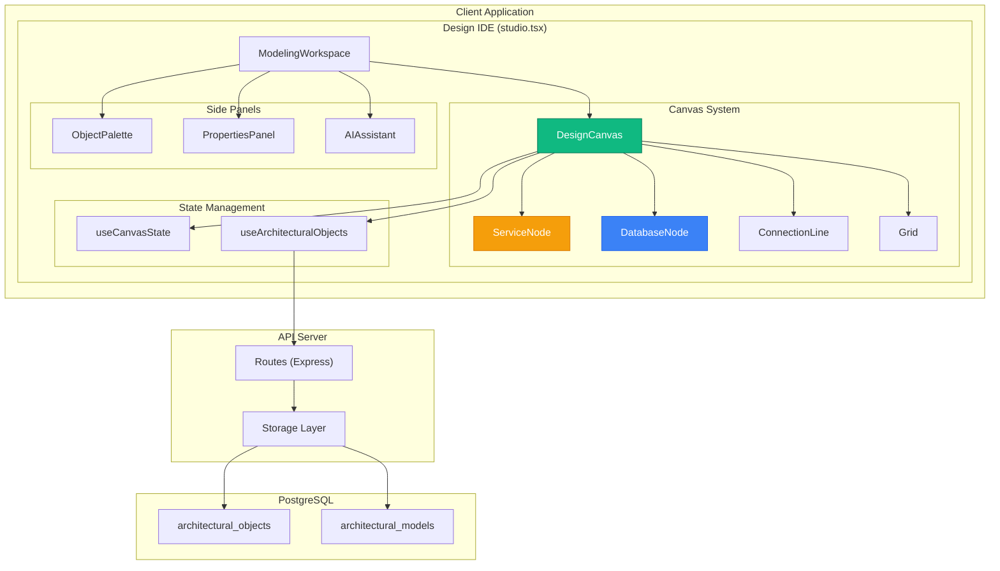
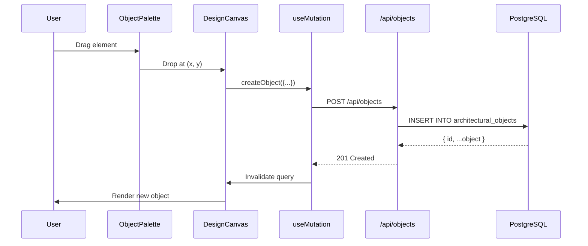
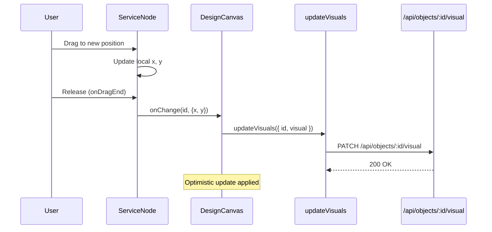

# ARKHITEKTON | TDS-CANVAS-001
# Design Canvas Module - Technical Design Specification

| Field | Value |
|-------|-------|
| **Document ID** | TDS-CANVAS-001 |
| **Version** | 1.0 |
| **Date** | December 2025 |
| **Status** | Approved |
| **Module** | Design Canvas (Modeling Canvas Engine) |
| **Parent Module** | Design Studio / Design IDE |
| **Epic** | EPIC-IDE-02: Modeling Canvas Engine |
| **Decision** | **Option B: React Konva (HTML5 Canvas)** |
| **Decision Date** | December 20, 2025 |

---

## Table of Contents

1. [Executive Summary](#1-executive-summary)
2. [Design Decision](#2-design-decision)
3. [Architecture Overview](#3-architecture-overview)
4. [Component Architecture](#4-component-architecture)
5. [Data Flow](#5-data-flow)
6. [Technical Implementation](#6-technical-implementation)
7. [User Story Traceability](#7-user-story-traceability)
8. [Implementation Phases](#8-implementation-phases)
9. [API Contracts](#9-api-contracts)
10. [Performance Requirements](#10-performance-requirements)
11. [Testing Strategy](#11-testing-strategy)

---

## 1. Executive Summary

This Technical Design Specification (TDS) documents the architecture and implementation approach for the ARKHITEKTON Design Canvas module. The canvas is the core rendering surface for architectural modeling within the Design IDE.

### 1.1 Scope

The Design Canvas provides:
- Infinite canvas with pan/zoom capabilities
- Draggable architectural elements (shapes/nodes)
- Dynamic connections between elements
- Real-time collaboration support
- Export to PNG/SVG/PDF formats

### 1.2 Key Technologies

| Technology | Purpose | Version |
|------------|---------|---------|
| **React Konva** | Canvas rendering library | ^18.2.10 |
| **Konva.js** | Underlying HTML5 Canvas | ^9.x |
| **React** | UI framework | ^18.2.0 |
| **TypeScript** | Type safety | ^5.x |
| **TanStack Query** | API state management | ^5.x |

---

## 2. Design Decision

### 2.1 Decision Record

**Decision:** Adopt **Option B: React Konva (HTML5 Canvas)** for the Design Canvas implementation.

**Alternatives Considered:**

| Option | Approach | Verdict |
|--------|----------|---------|
| **A: Static HTML/CSS** | Positioned HTML divs with hardcoded SVG lines | ❌ Rejected |
| **B: React Konva** | HTML5 Canvas with react-konva wrapper | ✅ **Approved** |

### 2.2 Rationale

| Criteria | Option A (HTML/CSS) | Option B (React Konva) |
|----------|---------------------|------------------------|
| **Draggable Shapes** | ❌ Not functional | ✅ Truly draggable |
| **Dynamic Connections** | ❌ Hardcoded SVG | ✅ Auto-update on move |
| **Zoom & Pan** | ❌ Complex to implement | ✅ Built-in support |
| **Performance (100+ shapes)** | ❌ DOM bottleneck | ✅ Canvas optimized |
| **Export (PNG/SVG)** | ❌ Manual capture | ✅ Native export API |
| **Framework Integration** | ✅ Standard React | ✅ react-konva wrapper |
| **Developer Experience** | ✅ Familiar | 〰️ Learning curve |

### 2.3 Design Option Reference

This decision was formally evaluated in the Design Options module:
- **Category:** Technical Design
- **Option ID:** ARKCI-00002
- **Route:** `/design-options/canvas-implementation`

---

## 3. Architecture Overview

### 3.1 High-Level Architecture Diagram



### 3.2 Canvas Rendering Stack

```
┌─────────────────────────────────────────────────────────┐
│                    React Application                      │
├─────────────────────────────────────────────────────────┤
│  DesignCanvas (React Component)                          │
│  ┌─────────────────────────────────────────────────────┐ │
│  │  <Stage> (react-konva)                              │ │
│  │  ┌─────────────────────────────────────────────────┐│ │
│  │  │  <Layer> (Grid - non-interactive)              ││ │
│  │  └─────────────────────────────────────────────────┘│ │
│  │  ┌─────────────────────────────────────────────────┐│ │
│  │  │  <Layer> (Objects)                             ││ │
│  │  │   ├── ServiceNode (draggable Group)            ││ │
│  │  │   ├── DatabaseNode (draggable Group)           ││ │
│  │  │   └── ConnectionLine (Arrow/Line)              ││ │
│  │  └─────────────────────────────────────────────────┘│ │
│  │  ┌─────────────────────────────────────────────────┐│ │
│  │  │  <Layer> (Selection/Handles)                   ││ │
│  │  └─────────────────────────────────────────────────┘│ │
│  └─────────────────────────────────────────────────────┘ │
├─────────────────────────────────────────────────────────┤
│                    Konva.js (Core)                       │
├─────────────────────────────────────────────────────────┤
│                 HTML5 Canvas Element                     │
└─────────────────────────────────────────────────────────┘
```

---

## 4. Component Architecture

### 4.1 Component Hierarchy

```
client/src/components/
├── canvas/
│   ├── DesignCanvas.tsx          # Main canvas component
│   ├── hooks/
│   │   ├── useCanvasState.ts     # Pan/zoom state management
│   │   └── useArchitecturalObjects.ts  # CRUD hooks for objects
│   └── shapes/
│       ├── ServiceNode.tsx       # Service/Application node
│       ├── DatabaseNode.tsx      # Database/Storage node
│       ├── ConnectionLine.tsx    # Connection arrows (TODO)
│       ├── GroupContainer.tsx    # Grouping container (TODO)
│       └── index.ts              # Barrel export
├── modeling/
│   ├── modeling-workspace.tsx    # Workspace orchestrator
│   ├── architectural-object-palette.tsx  # Drag source
│   ├── properties-panel.tsx      # Selected object properties
│   └── modeling-toolbar.tsx      # Canvas actions toolbar
```

### 4.2 Component Specifications

#### 4.2.1 DesignCanvas

| Property | Type | Description |
|----------|------|-------------|
| `objects` | `ArchitecturalObject[]` | Array of objects to render |
| `selectedIds` | `string[]` | Currently selected object IDs |
| `onObjectSelect` | `(ids: string[]) => void` | Selection callback |
| `onObjectChange` | `(id, attrs) => void` | Position/size change callback |
| `isLoading` | `boolean` | Show loading indicator |
| `width` | `number` | Optional fixed width |
| `height` | `number` | Optional fixed height |

**Responsibilities:**
1. Render Konva Stage with pan/zoom
2. Render grid layer (non-interactive)
3. Render object layer with nodes
4. Handle selection events
5. Handle drag events for position updates

#### 4.2.2 ServiceNode

| Property | Type | Description |
|----------|------|-------------|
| `id` | `string` | Unique object identifier |
| `x` | `number` | X position on canvas |
| `y` | `number` | Y position on canvas |
| `label` | `string` | Display name |
| `isSelected` | `boolean` | Selection state |
| `onSelect` | `(id: string) => void` | Click handler |
| `onChange` | `(id, {x, y}) => void` | Drag end handler |

**Visual Representation:**
```
┌────────────────────┐
│  ┌────┐            │
│  │ 📦 │  API       │
│  └────┘  Gateway   │
└────────────────────┘
```

#### 4.2.3 DatabaseNode

Identical interface to ServiceNode but renders with database iconography:
```
  ╭────────╮
 ╱          ╲
│  Database  │
│   Name     │
 ╲──────────╱
  ╰────────╯
```

### 4.3 State Management Hooks

#### 4.3.1 useCanvasState

```typescript
interface CanvasState {
  x: number;       // Stage X offset
  y: number;       // Stage Y offset
  scale: number;   // Zoom level (0.1 - 4.0)
}

function useCanvasState(): {
  stageState: CanvasState;
  handleWheel: (e: KonvaEventObject<WheelEvent>) => void;
  handleDragEnd: (e: KonvaEventObject<DragEvent>) => void;
  setScale: (scale: number) => void;
  resetView: () => void;
}
```

#### 4.3.2 useArchitecturalObjects

```typescript
function useArchitecturalObjects(modelId: string): UseQueryResult<ArchitecturalObject[]>;
function useCreateArchitecturalObject(): UseMutationResult;
function useUpdateArchitecturalObject(): UseMutationResult;
function useUpdateArchitecturalObjectVisuals(): UseMutationResult;
function useDeleteArchitecturalObject(): UseMutationResult;
```

---

## 5. Data Flow

### 5.1 Object Creation Flow



### 5.2 Position Update Flow



---

## 6. Technical Implementation

### 6.1 Core Canvas Implementation

```typescript
// DesignCanvas.tsx - Simplified structure
export const DesignCanvas: React.FC<DesignCanvasProps> = ({
  objects,
  selectedIds,
  onObjectSelect,
  onObjectChange,
}) => {
  const { stageState, handleWheel, handleDragEnd } = useCanvasState();

  return (
    <Stage
      width={size.width}
      height={size.height}
      draggable
      onWheel={handleWheel}
      onDragEnd={handleDragEnd}
      scaleX={stageState.scale}
      scaleY={stageState.scale}
      x={stageState.x}
      y={stageState.y}
    >
      <GridLayer />
      <Layer>
        {objects.map((obj) => (
          <ShapeNode
            key={obj.id}
            {...obj}
            isSelected={selectedIds.includes(obj.id)}
            onSelect={onObjectSelect}
            onChange={onObjectChange}
          />
        ))}
      </Layer>
      <SelectionLayer selectedIds={selectedIds} />
    </Stage>
  );
};
```

### 6.2 Shape Node Implementation

```typescript
// shapes/ServiceNode.tsx
export const ServiceNode: React.FC<NodeProps> = ({
  id, x, y, label, isSelected, onSelect, onChange
}) => {
  const handleDragEnd = (e: KonvaEventObject<DragEvent>) => {
    onChange(id, { x: e.target.x(), y: e.target.y() });
  };

  return (
    <Group
      x={x}
      y={y}
      draggable
      onDragEnd={handleDragEnd}
      onClick={() => onSelect(id)}
    >
      <Rect
        width={160}
        height={60}
        fill="#fff"
        stroke={isSelected ? '#10B981' : '#CBD5E1'}
        strokeWidth={isSelected ? 3 : 1}
        cornerRadius={8}
        shadowBlur={isSelected ? 8 : 4}
      />
      <Text
        text={label}
        fontSize={14}
        fill="#1E293B"
        align="center"
        width={160}
        y={22}
      />
    </Group>
  );
};
```

### 6.3 Connection System (Phase 2)

```typescript
// shapes/ConnectionLine.tsx (To be implemented)
interface ConnectionProps {
  fromId: string;
  toId: string;
  fromAnchor: 'top' | 'right' | 'bottom' | 'left';
  toAnchor: 'top' | 'right' | 'bottom' | 'left';
  type: 'association' | 'dependency' | 'flow';
  label?: string;
}

export const ConnectionLine: React.FC<ConnectionProps> = ({
  fromId, toId, fromAnchor, toAnchor, type, label
}) => {
  const fromPos = useObjectPosition(fromId, fromAnchor);
  const toPos = useObjectPosition(toId, toAnchor);
  
  const points = calculatePath(fromPos, toPos, type);
  
  return (
    <Arrow
      points={points}
      stroke={getConnectionColor(type)}
      strokeWidth={2}
      pointerLength={10}
      pointerWidth={8}
    />
  );
};
```

---

## 7. User Story Traceability

### 7.1 Epic Coverage

| Epic | Name | Stories | Points | Status |
|------|------|---------|--------|--------|
| EPIC-IDE-02 | Modeling Canvas Engine | 9 | 59 | In Progress |

### 7.2 Story Mapping

| Story ID | Title | Points | HLR | Implementation |
|----------|-------|--------|-----|----------------|
| US-CVS-001 | Infinite Canvas Pan/Zoom | 5 | HLR-CVS-001-003 | `useCanvasState.ts` |
| US-CVS-002 | Grid Snapping | 5 | HLR-CVS-004-005 | `DesignCanvas.tsx` |
| US-CVS-003 | Smart Alignment Guides | 8 | HLR-CVS-006 | TODO |
| US-CVS-004 | Drag-Drop Elements | 5 | HLR-CVS-010-011 | `ServiceNode.tsx` |
| US-CVS-005 | Resize & Rotate | 8 | HLR-CVS-012-013 | TODO |
| US-CVS-006 | Connection System | 8 | HLR-CVS-020-022 | TODO |
| US-CVS-007 | Undo/Redo History | 8 | HLR-CVS-030-031 | TODO |
| US-CVS-008 | Multi-Selection | 5 | HLR-CVS-040-041 | Partial |
| US-CVS-009 | Export PNG/SVG/PDF | 7 | HLR-CVS-050-051 | TODO |

### 7.3 Gherkin Reference

See `docs/ARKDL-0006-Design-IDE-Requirements-Complete.md` Section 5.2 for full Gherkin specifications.

**Sample - US-CVS-001:**
```gherkin
Feature: Infinite Canvas Navigation

  Scenario: Smooth panning across the canvas
    Given I have a model open in the Design IDE
    When I click and drag on an empty canvas area
    Then the canvas should pan smoothly at 60fps minimum
    And all elements should maintain their relative positions

  Scenario: Zoom centered on cursor
    Given I have a model with elements on the canvas
    When I hold Ctrl and scroll the mouse wheel up
    Then the canvas should zoom in centered on my cursor position
    And the zoom level should be displayed in the status area
```

---

## 8. Implementation Phases

### 8.1 Phase 1: Foundation (MVP) ✅ Complete

| Feature | Status | Components |
|---------|--------|------------|
| Stage setup | ✅ Done | `DesignCanvas.tsx` |
| Pan/Zoom | ✅ Done | `useCanvasState.ts` |
| Grid rendering | ✅ Done | `DesignCanvas.tsx` |
| Basic nodes | ✅ Done | `ServiceNode.tsx`, `DatabaseNode.tsx` |
| Drag to move | ✅ Done | `ServiceNode.tsx` |
| Single selection | ✅ Done | `DesignCanvas.tsx` |
| API integration | ✅ Done | `useArchitecturalObjects.ts` |

### 8.2 Phase 2: Connections & Selection (In Progress)

| Feature | Status | Components |
|---------|--------|------------|
| Connection arrows | 🔄 TODO | `ConnectionLine.tsx` |
| Dynamic routing | 🔄 TODO | `useConnectionPath.ts` |
| Marquee selection | 🔄 TODO | `SelectionBox.tsx` |
| Multi-select operations | 🔄 TODO | `useMultiSelect.ts` |
| Resize handles | 🔄 TODO | `TransformHandles.tsx` |

### 8.3 Phase 3: Advanced Features

| Feature | Status | Components |
|---------|--------|------------|
| Smart guides | 🔲 Planned | `AlignmentGuides.tsx` |
| Snap to grid | 🔲 Planned | `useGridSnap.ts` |
| Undo/Redo stack | 🔲 Planned | `useHistory.ts` |
| Group containers | 🔲 Planned | `GroupContainer.tsx` |
| Export system | 🔲 Planned | `useCanvasExport.ts` |
| Minimap | 🔲 Planned | `Minimap.tsx` |

---

## 9. API Contracts

### 9.1 Architectural Objects API

```typescript
// GET /api/objects?modelId=:modelId
Response: ArchitecturalObject[]

// POST /api/objects
Request: InsertArchitecturalObject
Response: ArchitecturalObject

// PATCH /api/objects/:id
Request: Partial<ArchitecturalObject>
Response: ArchitecturalObject

// PATCH /api/objects/:id/visual
Request: { visual: ObjectVisual }
Response: ArchitecturalObject

// DELETE /api/objects/:id
Response: 204 No Content
```

### 9.2 Object Visual Schema

```typescript
interface ObjectVisual {
  shape: 'rectangle' | 'roundedRect' | 'circle' | 'diamond' | 'cylinder';
  position: { x: number; y: number };
  size: { width: number; height: number };
  styling: {
    color: string;
    borderColor?: string;
    borderWidth?: number;
    opacity?: number;
  };
  ports: Array<{
    id: string;
    position: 'top' | 'right' | 'bottom' | 'left';
    type: 'input' | 'output' | 'bidirectional';
  }>;
  annotations: Array<{
    id: string;
    type: 'comment' | 'warning' | 'decision';
    content: string;
    position: { x: number; y: number };
  }>;
}
```

---

## 10. Performance Requirements

| Metric | Requirement | Measurement |
|--------|-------------|-------------|
| **Render FPS** | ≥ 60fps during pan/zoom | Chrome DevTools |
| **Object Count** | Support 500+ objects | Manual test |
| **Load Time** | Canvas ready in < 2s | Performance API |
| **Drag Latency** | < 16ms response | React Profiler |
| **Memory** | < 100MB for 500 objects | Memory profiler |

### 10.1 Optimization Strategies

1. **Layer Separation**: Grid on non-interactive layer
2. **Viewport Culling**: Only render visible objects
3. **Throttled Updates**: Debounce position saves (300ms)
4. **Optimistic UI**: Update local state immediately
5. **Memoization**: React.memo for node components

---

## 11. Testing Strategy

### 11.1 Unit Tests

| Component | Test File | Coverage Target |
|-----------|-----------|-----------------|
| DesignCanvas | `DesignCanvas.test.tsx` | 80% |
| ServiceNode | `ServiceNode.test.tsx` | 90% |
| useCanvasState | `useCanvasState.test.ts` | 95% |
| useArchitecturalObjects | `useArchitecturalObjects.test.ts` | 85% |

### 11.2 Integration Tests

```typescript
describe('Canvas Integration', () => {
  it('should render objects from API', async () => {
    render(<DesignCanvas objects={mockObjects} {...props} />);
    expect(screen.getByTestId('canvas-stage')).toBeInTheDocument();
  });

  it('should update position on drag', async () => {
    const onObjectChange = jest.fn();
    render(<DesignCanvas onObjectChange={onObjectChange} {...props} />);
    
    fireEvent.drag(screen.getByTestId('node-1'), { delta: { x: 100, y: 50 } });
    
    expect(onObjectChange).toHaveBeenCalledWith('node-1', { x: 200, y: 150 });
  });
});
```

### 11.3 E2E Tests (Playwright)

```typescript
test('canvas drag and drop workflow', async ({ page }) => {
  await page.goto('/studio/canvas-advanced');
  
  // Drag from palette
  await page.locator('[data-testid="palette-service"]').dragTo(
    page.locator('[data-testid="canvas-stage"]'),
    { targetPosition: { x: 300, y: 200 } }
  );
  
  // Verify node created
  await expect(page.locator('[data-testid^="node-"]')).toHaveCount(1);
});
```

---

## Appendix A: File Inventory

| File | Purpose | LOC |
|------|---------|-----|
| `DesignCanvas.tsx` | Main canvas component | ~160 |
| `useCanvasState.ts` | Pan/zoom state | ~50 |
| `useArchitecturalObjects.ts` | API hooks | ~100 |
| `ServiceNode.tsx` | Service shape | ~80 |
| `DatabaseNode.tsx` | Database shape | ~80 |

---

## Appendix B: Revision History

| Version | Date | Author | Changes |
|---------|------|--------|---------|
| 1.0 | Dec 20, 2025 | ARKHITEKTON | Initial TDS - Option B approved |

---

*This document is maintained as part of the ARKHITEKTON Design System and should be updated as implementation progresses.*

