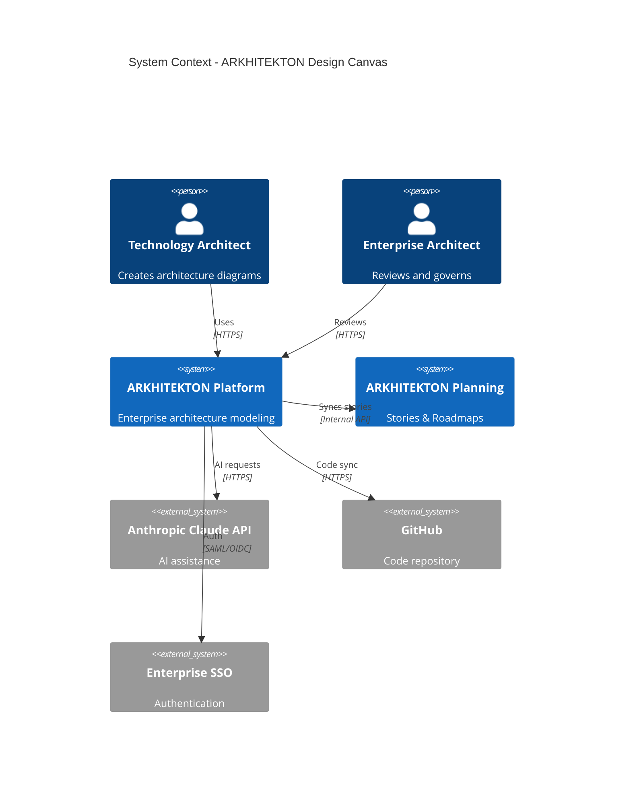
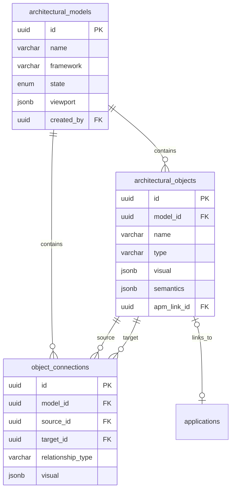
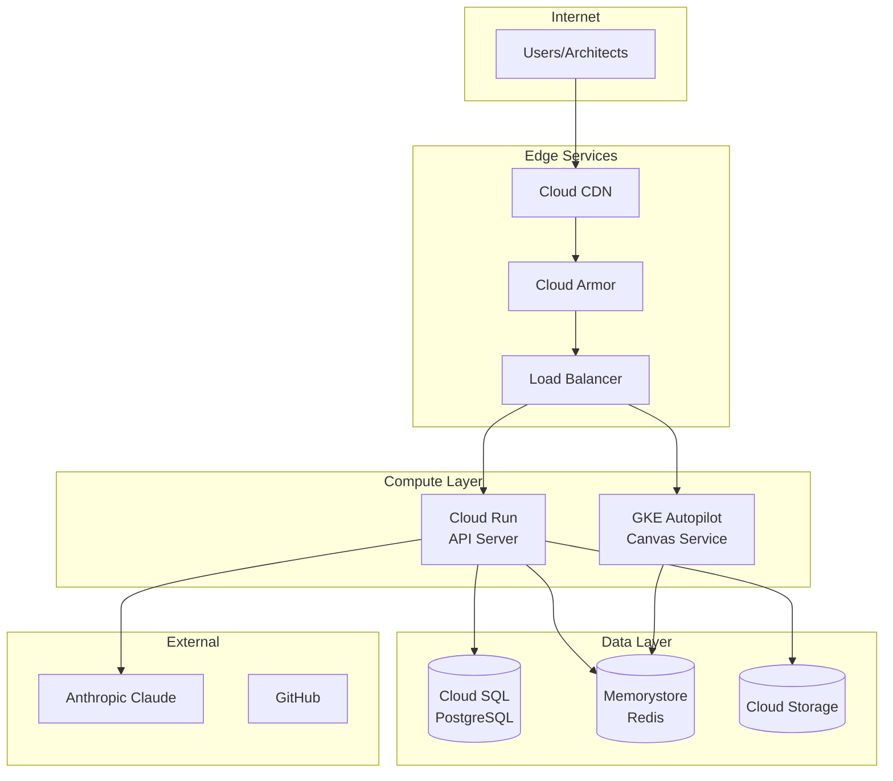
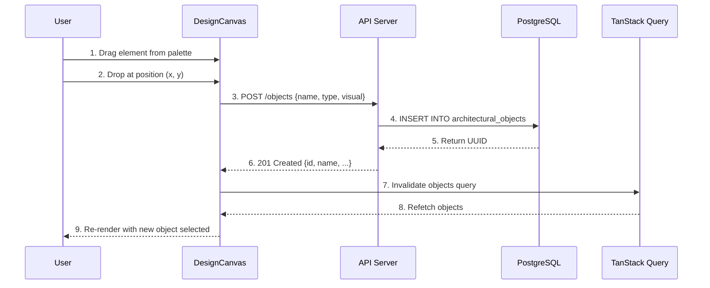

# ARKHITEKTON
## Design Canvas Module
### Technical Design Specification

---

| Field | Value |
|-------|-------|
| **Document ID** | TDS-CANVAS-002 |
| **Version** | 2.0 |
| **Date** | December 2025 |
| **Status** | Draft - For Review |
| **Module** | Design Canvas (Modeling Canvas Engine) |
| **Epic** | EPIC-IDE-02: Modeling Canvas Engine |
| **Technology** | React Konva (HTML5 Canvas) - MIT License |

---

## Table of Contents

1. [Executive Summary](#1-executive-summary)
2. [Design Decision Record](#2-design-decision-record)
3. [System Context Diagram (C4 Level 1)](#3-system-context-diagram-c4-level-1)
4. [Container Diagram (C4 Level 2)](#4-container-diagram-c4-level-2)
5. [Component Architecture (C4 Level 3)](#5-component-architecture-c4-level-3)
6. [Entity Relationship Diagram](#6-entity-relationship-diagram-data-model)
7. [GCP Infrastructure Diagram](#7-gcp-infrastructure-diagram)
8. [Sequence Diagrams](#8-sequence-diagrams)
9. [API Contracts](#9-api-contracts)
10. [User Story Traceability Matrix](#10-user-story-traceability-matrix)
11. [Implementation Phases](#11-implementation-phases)
12. [Performance Requirements](#12-performance-requirements)
13. [Appendix A: Mermaid Diagram Source Code](#appendix-a-mermaid-diagram-source-code)
14. [Appendix B: TypeScript Interfaces](#appendix-b-typescript-interfaces)

---

## 1. Executive Summary

### 1.1 Purpose

This Technical Design Specification documents the comprehensive architecture for the ARKHITEKTON Design Canvas module. The canvas is the core rendering surface for architectural modeling within the Design IDE, enabling technology architects to create, visualize, and manage enterprise architecture diagrams with semantic intelligence.

### 1.2 Scope

The Design Canvas module provides:

- **Infinite canvas** with pan/zoom capabilities (10% to 400% zoom range)
- **Draggable architectural elements** supporting 170+ element types
- **Dynamic connections** between elements with relationship validation
- **Real-time collaboration** support via WebSocket and CRDT synchronization
- **AI-assisted modeling** with Claude Sonnet integration
- **Export capabilities** to PNG, SVG, and PDF formats

### 1.3 Key Technologies

| Technology | Purpose | Version |
|------------|---------|---------|
| **React Konva** | Canvas rendering library with React bindings | ^18.2.10 |
| **Konva.js** | Underlying HTML5 Canvas 2D engine | ^9.x |
| **React** | UI framework | ^18.2.0 |
| **TypeScript** | Type safety and developer experience | ^5.x |
| **TanStack Query** | API state management and caching | ^5.x |
| **Zustand** | Client state management | ^4.x |
| **Yjs** | CRDT for real-time collaboration | ^13.x |
| **PostgreSQL** | Primary database with pgvector | ^15.x |

### 1.4 Document Audience

| Role | Interest |
|------|----------|
| **Frontend Developers** | Component architecture, React patterns, state management |
| **Backend Developers** | API contracts, database schema, WebSocket protocol |
| **DevOps Engineers** | Infrastructure diagram, deployment configuration |
| **Product Managers** | User story traceability, implementation phases |
| **QA Engineers** | Performance requirements, acceptance criteria |

---

## 2. Design Decision Record

### 2.1 Decision

**Decision:** Adopt React Konva (HTML5 Canvas) for the Design Canvas implementation.

**Date:** November 2025  
**Status:** APPROVED  
**Deciders:** Technical Lead, Principal Architect

### 2.2 Alternatives Considered

| Option | Approach | Verdict | Rationale |
|--------|----------|---------|-----------|
| **A: Static HTML/CSS** | Positioned HTML divs with hardcoded SVG | ❌ Rejected | No true drag-and-drop, DOM performance issues |
| **B: React Konva** | HTML5 Canvas with react-konva wrapper | ✅ **APPROVED** | Best balance of features, performance, and cost |
| **C: tldraw** | Commercial canvas library ($6K/yr) | ❌ Rejected | License cost, vendor lock-in concerns |
| **D: React Flow** | Node-based flowchart library | ❌ Rejected | Designed for flowcharts, not freeform diagrams |
| **E: Excalidraw** | Open-source whiteboard | ❌ Rejected | Whiteboard-focused, limited EA customization |
| **F: Fabric.js** | Canvas library with object model | ⚠️ Considered | Heavier bundle, jQuery-era API patterns |

### 2.3 Decision Rationale

| Criteria | HTML/CSS | React Konva | tldraw |
|----------|----------|-------------|--------|
| **Draggable Shapes** | Not functional | ✅ Truly draggable | ✅ Built-in |
| **Dynamic Connections** | Hardcoded SVG | ✅ Auto-update on move | ✅ Built-in |
| **Zoom & Pan** | Complex CSS transforms | ✅ Built-in support | ✅ Built-in |
| **Performance (500+ objects)** | DOM bottleneck | ✅ Canvas optimized | ✅ Optimized |
| **Export (PNG/SVG)** | Manual capture | ✅ Native API | ✅ Native |
| **License Cost** | $0 | ✅ $0 (MIT) | ❌ $6K/year |
| **Customization** | Full control | ✅ Full control | ⚠️ Limited |
| **Learning Curve** | Low | Medium | Low |

### 2.4 Consequences

**Positive:**
- Full control over canvas behavior and appearance
- No licensing costs or vendor dependencies
- Strong React ecosystem integration
- WebGL acceleration available for complex diagrams

**Negative:**
- More development effort than commercial alternatives
- Need to build collaboration features from scratch
- Responsible for accessibility compliance

**Mitigations:**
- Use Yjs for CRDT-based collaboration (proven library)
- Implement progressive enhancement for accessibility
- Create comprehensive component library for reuse

---

## 3. System Context Diagram (C4 Level 1)

The System Context diagram shows how the Design Canvas module fits within the broader Arkhitekton platform and its external dependencies.

```
┌─────────────────────────────────────────────────────────────────────────────┐
│                           SYSTEM CONTEXT                                     │
│                    ARKHITEKTON Design Canvas                                 │
└─────────────────────────────────────────────────────────────────────────────┘

    ┌──────────────┐         ┌──────────────┐         ┌──────────────┐
    │  Technology  │         │  Enterprise  │         │ Development  │
    │   Architect  │         │   Architect  │         │    Team      │
    │    [User]    │         │    [User]    │         │  [Consumer]  │
    └──────┬───────┘         └──────┬───────┘         └──────┬───────┘
           │                        │                        │
           │ Creates/edits          │ Reviews/governs        │ Views/exports
           │ diagrams               │ diagrams               │ specs
           ▼                        ▼                        ▼
    ┌─────────────────────────────────────────────────────────────────┐
    │                                                                 │
    │                    ARKHITEKTON PLATFORM                         │
    │                                                                 │
    │  ┌─────────────────────────────────────────────────────────┐   │
    │  │                   DESIGN CANVAS                          │   │
    │  │                                                          │   │
    │  │  • Infinite canvas with pan/zoom                         │   │
    │  │  • 170+ architectural elements                           │   │
    │  │  • Dynamic connections                                   │   │
    │  │  • Real-time collaboration                               │   │
    │  │  • AI-assisted modeling                                  │   │
    │  └─────────────────────────────────────────────────────────┘   │
    │                                                                 │
    └───────────────────────────┬─────────────────────────────────────┘
                                │
           ┌────────────────────┼────────────────────┐
           │                    │                    │
           ▼                    ▼                    ▼
    ┌──────────────┐     ┌──────────────┐     ┌──────────────┐
    │   Anthropic  │     │    GitHub    │     │  Enterprise  │
    │  Claude API  │     │              │     │     SSO      │
    │  [External]  │     │  [External]  │     │  [External]  │
    └──────────────┘     └──────────────┘     └──────────────┘
      AI requests          Code sync          Authentication
```

### 3.1 External Actors

| Actor | Type | Interaction |
|-------|------|-------------|
| **Technology Architect** | Primary User | Creates and edits architecture diagrams |
| **Enterprise Architect** | Primary User | Reviews diagrams, manages governance |
| **Development Team** | Consumer | Views architecture, exports specifications |
| **AI Services** | External System | Claude API for intelligent assistance |
| **ARKHITEKTON Planning** | Internal System | Stories and roadmap management |

### 3.2 System Boundaries

| Boundary | In Scope | Out of Scope |
|----------|----------|--------------|
| **Frontend** | Canvas rendering, user interactions, state management | Mobile native apps |
| **Backend** | REST API, WebSocket, persistence | Legacy system integrations |
| **AI** | Claude integration for suggestions | Custom ML model training |
| **Auth** | SSO integration | Identity provider management |

---

## 4. Container Diagram (C4 Level 2)

The Container diagram shows the high-level technology choices and how responsibilities are distributed across deployable units.

```
┌─────────────────────────────────────────────────────────────────────────────┐
│                           CONTAINER DIAGRAM                                  │
│                    ARKHITEKTON Design Canvas                                 │
└─────────────────────────────────────────────────────────────────────────────┘

                              ┌─────────────────┐
                              │   Cloud CDN     │
                              │   (Static)      │
                              └────────┬────────┘
                                       │
                                       ▼
┌──────────────────────────────────────────────────────────────────────────────┐
│  WEB APPLICATION                                                             │
│  ┌────────────────────────────────────────────────────────────────────────┐  │
│  │  React 18 + Next.js 14                                                  │  │
│  │                                                                          │  │
│  │  ┌──────────────┐  ┌──────────────┐  ┌──────────────┐  ┌─────────────┐ │  │
│  │  │Design Canvas │  │   Element    │  │  Properties  │  │   Toolbar   │ │  │
│  │  │   (Konva)    │  │   Palette    │  │    Panel     │  │   & Menu    │ │  │
│  │  └──────────────┘  └──────────────┘  └──────────────┘  └─────────────┘ │  │
│  │                                                                          │  │
│  │  ┌──────────────────────────────────────────────────────────────────┐   │  │
│  │  │  State: Zustand + TanStack Query + Yjs (CRDT)                     │   │  │
│  │  └──────────────────────────────────────────────────────────────────┘   │  │
│  └────────────────────────────────────────────────────────────────────────┘  │
└───────────────────────────────────┬──────────────────────────────────────────┘
                                    │
                    ┌───────────────┼───────────────┐
                    │               │               │
                    ▼               ▼               ▼
          ┌─────────────────┐ ┌─────────────┐ ┌─────────────────┐
          │   API SERVER    │ │   CANVAS    │ │   AI SERVICE    │
          │                 │ │   SERVICE   │ │                 │
          │  Node.js        │ │  Node.js    │ │  Python         │
          │  Express        │ │  WebSocket  │ │  FastAPI        │
          │  REST/GraphQL   │ │  Yjs Server │ │  Claude SDK     │
          │                 │ │             │ │                 │
          │  Cloud Run      │ │  GKE        │ │  Cloud Run      │
          └────────┬────────┘ └──────┬──────┘ └────────┬────────┘
                   │                 │                 │
                   ▼                 ▼                 │
          ┌─────────────────────────────────┐         │
          │         POSTGRESQL 15           │         │
          │                                 │         │
          │  • architectural_models         │         │
          │  • architectural_objects        │         │
          │  • object_connections           │         │
          │  • model_versions               │         │
          │                                 │         │
          │         Cloud SQL (HA)          │         │
          └─────────────────────────────────┘         │
                                                      │
          ┌─────────────────┐                         │
          │     REDIS 7     │                         │
          │                 │                         ▼
          │  • Session      │              ┌─────────────────┐
          │  • Rate limit   │              │  ANTHROPIC API  │
          │  • Pub/Sub      │              │                 │
          │                 │              │  Claude Sonnet  │
          │  Memorystore    │              │  (External)     │
          └─────────────────┘              └─────────────────┘
```

### 4.1 Container Inventory

| Container | Technology | Responsibility | Deployment |
|-----------|------------|----------------|------------|
| **Web Application** | React 18, Next.js 14 | SPA frontend, Canvas UI | Cloud CDN / GCS |
| **API Server** | Node.js, Express | REST/GraphQL API | Cloud Run / GKE |
| **Canvas Service** | Node.js, WebSocket | Real-time collaboration | GKE (stateful) |
| **AI Service** | Python, FastAPI | Claude integration | Cloud Run |
| **Database** | PostgreSQL 15 | Persistent storage | Cloud SQL (HA) |
| **Cache** | Redis 7 | Session, rate limit | Memorystore |

### 4.2 Communication Protocols

| From | To | Protocol | Purpose |
|------|-----|----------|---------|
| Web App | API Server | HTTPS/REST | CRUD operations |
| Web App | Canvas Service | WSS | Real-time sync |
| Web App | AI Service | HTTPS | AI suggestions |
| API Server | PostgreSQL | TCP/5432 | Data persistence |
| Canvas Service | Redis | TCP/6379 | Pub/Sub for rooms |
| AI Service | Claude API | HTTPS | LLM requests |

---

## 5. Component Architecture (C4 Level 3)

The Component diagram shows the internal structure of the Design Canvas container.

```
┌─────────────────────────────────────────────────────────────────────────────┐
│                        COMPONENT ARCHITECTURE                                │
│                         Design Canvas Module                                 │
└─────────────────────────────────────────────────────────────────────────────┘

┌─────────────────────────────────────────────────────────────────────────────┐
│  PRESENTATION LAYER                                                         │
│                                                                             │
│  ┌─────────────────┐  ┌─────────────────┐  ┌─────────────────┐             │
│  │  DesignCanvas   │  │  CanvasToolbar  │  │    Minimap      │             │
│  │     .tsx        │  │     .tsx        │  │     .tsx        │             │
│  │                 │  │                 │  │                 │             │
│  │  Main Stage     │  │  Zoom controls  │  │  Navigation     │             │
│  │  Grid layer     │  │  Grid toggle    │  │  overview       │             │
│  │  Objects layer  │  │  Export menu    │  │                 │             │
│  │  Connections    │  │  AI trigger     │  │                 │             │
│  └────────┬────────┘  └────────┬────────┘  └────────┬────────┘             │
│           │                    │                    │                       │
└───────────┼────────────────────┼────────────────────┼───────────────────────┘
            │                    │                    │
            ▼                    ▼                    ▼
┌─────────────────────────────────────────────────────────────────────────────┐
│  SHAPES LAYER                                                               │
│                                                                             │
│  ┌─────────────────┐  ┌─────────────────┐  ┌─────────────────┐             │
│  │   ServiceNode   │  │  DatabaseNode   │  │ ConnectionLine  │             │
│  │     .tsx        │  │     .tsx        │  │     .tsx        │             │
│  │                 │  │                 │  │                 │             │
│  │  Application    │  │  Data stores    │  │  Relationship   │             │
│  │  components     │  │  Cylinder shape │  │  arrows         │             │
│  │  Rect + Text    │  │                 │  │  Bezier curves  │             │
│  └─────────────────┘  └─────────────────┘  └─────────────────┘             │
│                                                                             │
│  ┌─────────────────┐  ┌─────────────────┐  ┌─────────────────┐             │
│  │ GroupContainer  │  │ TransformHandle │  │  SelectionBox   │             │
│  │     .tsx        │  │     .tsx        │  │     .tsx        │             │
│  │                 │  │                 │  │                 │             │
│  │  Grouping       │  │  Resize/rotate  │  │  Marquee        │             │
│  │  container      │  │  handles        │  │  selection      │             │
│  └─────────────────┘  └─────────────────┘  └─────────────────┘             │
│                                                                             │
└─────────────────────────────────────────────────────────────────────────────┘
            │
            ▼
┌─────────────────────────────────────────────────────────────────────────────┐
│  HOOKS LAYER (State Management)                                             │
│                                                                             │
│  ┌─────────────────┐  ┌─────────────────┐  ┌─────────────────┐             │
│  │ useCanvasState  │  │ useArchObjects  │  │ useConnections  │             │
│  │     .ts         │  │     .ts         │  │     .ts         │             │
│  │                 │  │                 │  │                 │             │
│  │  Pan/zoom       │  │  CRUD for       │  │  Connection     │             │
│  │  Viewport       │  │  objects        │  │  management     │             │
│  │  Grid config    │  │  TanStack Query │  │  Validation     │             │
│  └─────────────────┘  └─────────────────┘  └─────────────────┘             │
│                                                                             │
│  ┌─────────────────┐  ┌─────────────────┐  ┌─────────────────┐             │
│  │   useHistory    │  │  useSelection   │  │ useCollaboration│             │
│  │     .ts         │  │     .ts         │  │     .ts         │             │
│  │                 │  │                 │  │                 │             │
│  │  Undo/redo      │  │  Single/multi   │  │  Yjs CRDT       │             │
│  │  Action stack   │  │  selection      │  │  WebSocket      │             │
│  └─────────────────┘  └─────────────────┘  └─────────────────┘             │
│                                                                             │
└─────────────────────────────────────────────────────────────────────────────┘
```

### 5.1 Component Hierarchy

```
client/src/components/
├── canvas/
│   ├── DesignCanvas.tsx          # Main canvas Stage
│   ├── CanvasToolbar.tsx         # Zoom, grid controls
│   ├── Minimap.tsx               # Navigation minimap
│   ├── ElementPalette.tsx        # Draggable element library
│   ├── PropertiesPanel.tsx       # Selected element properties
│   │
│   ├── hooks/
│   │   ├── useCanvasState.ts     # Pan/zoom management
│   │   ├── useArchitecturalObjects.ts  # CRUD hooks
│   │   ├── useConnections.ts     # Connection management
│   │   ├── useHistory.ts         # Undo/redo stack
│   │   ├── useSelection.ts       # Selection state
│   │   ├── useCollaboration.ts   # Yjs real-time sync
│   │   └── useCanvasExport.ts    # PNG/SVG/PDF export
│   │
│   ├── shapes/
│   │   ├── ServiceNode.tsx       # Application node
│   │   ├── DatabaseNode.tsx      # Database node
│   │   ├── PersonNode.tsx        # Actor/user node
│   │   ├── CloudNode.tsx         # Cloud service node
│   │   ├── ConnectionLine.tsx    # Relationship arrows
│   │   ├── GroupContainer.tsx    # Grouping container
│   │   ├── TransformHandles.tsx  # Resize/rotate handles
│   │   └── SelectionBox.tsx      # Marquee selection
│   │
│   └── layers/
│       ├── GridLayer.tsx         # Background grid
│       ├── ObjectsLayer.tsx      # Main objects
│       ├── ConnectionsLayer.tsx  # Relationship lines
│       └── OverlayLayer.tsx      # Selection, guides
```

### 5.2 Component Responsibilities

| Component | Responsibility | Dependencies |
|-----------|----------------|--------------|
| **DesignCanvas** | Main Stage container, event handling | useCanvasState, Konva Stage |
| **CanvasToolbar** | Zoom controls, grid toggle, export | useCanvasState, useCanvasExport |
| **Minimap** | Navigation overview, viewport indicator | useCanvasState |
| **ServiceNode** | Render application components | useArchitecturalObjects |
| **ConnectionLine** | Render and route relationships | useConnections |
| **useCanvasState** | Pan, zoom, grid state | Zustand |
| **useArchitecturalObjects** | CRUD operations | TanStack Query |
| **useHistory** | Undo/redo stack | Zustand |
| **useCollaboration** | Real-time sync | Yjs, WebSocket |

---

## 6. Entity Relationship Diagram (Data Model)

The Entity Relationship Diagram shows the PostgreSQL database schema that supports the Design Canvas module.

```
┌─────────────────────────────────────────────────────────────────────────────┐
│                      ENTITY RELATIONSHIP DIAGRAM                             │
└─────────────────────────────────────────────────────────────────────────────┘

┌─────────────────────────┐       ┌─────────────────────────┐
│   architectural_models  │       │       applications      │
├─────────────────────────┤       ├─────────────────────────┤
│ PK id: UUID             │       │ PK id: UUID             │
│    name: VARCHAR(255)   │       │    name: VARCHAR(255)   │
│    description: TEXT    │       │    status: VARCHAR(50)  │
│    framework: VARCHAR   │       │    tech_lead: UUID FK   │
│    state: ENUM          │       │    decommission: DATE   │
│    viewport: JSONB      │       └───────────┬─────────────┘
│    grid_config: JSONB   │                   │
│    created_by: UUID FK  │                   │ links_to (optional)
│    created_at: TIMESTAMP│                   │
│    updated_at: TIMESTAMP│                   │
└───────────┬─────────────┘                   │
            │                                 │
            │ contains                        │
            │                                 │
            ▼                                 │
┌─────────────────────────┐                   │
│  architectural_objects  │◄──────────────────┘
├─────────────────────────┤
│ PK id: UUID             │
│ FK model_id: UUID       │───────────────────┐
│    name: VARCHAR(255)   │                   │
│    type: VARCHAR(100)   │                   │
│    visual: JSONB        │                   │
│    semantics: JSONB     │                   │
│    lifecycle: JSONB     │                   │
│ FK apm_link_id: UUID    │                   │
│    z_index: INTEGER     │                   │
│    locked: BOOLEAN      │                   │
│    created_at: TIMESTAMP│                   │
│    updated_at: TIMESTAMP│                   │
└───────────┬─────────────┘                   │
            │                                 │
            │ source / target                 │
            │                                 │
            ▼                                 │
┌─────────────────────────┐                   │
│   object_connections    │                   │
├─────────────────────────┤                   │
│ PK id: UUID             │                   │
│ FK model_id: UUID       │───────────────────┘
│ FK source_id: UUID      │
│ FK target_id: UUID      │
│    relationship_type:   │
│      VARCHAR(50)        │
│    visual: JSONB        │
│    label: VARCHAR(255)  │
│    created_at: TIMESTAMP│
└─────────────────────────┘
```

### 6.1 Core Tables

#### architectural_models

| Column | Type | Nullable | Description |
|--------|------|----------|-------------|
| `id` | UUID | NO | Primary key |
| `name` | VARCHAR(255) | NO | Model display name |
| `description` | TEXT | YES | Model description |
| `framework` | VARCHAR(50) | NO | Primary notation (archimate, c4, aws, etc.) |
| `state` | ENUM | NO | draft \| published \| archived |
| `viewport` | JSONB | YES | Saved pan/zoom state |
| `grid_config` | JSONB | YES | Grid type, spacing, snap settings |
| `created_by` | UUID FK | NO | Reference to users |
| `created_at` | TIMESTAMP | NO | Creation timestamp |
| `updated_at` | TIMESTAMP | NO | Last modified timestamp |

#### architectural_objects

| Column | Type | Nullable | Description |
|--------|------|----------|-------------|
| `id` | UUID | NO | Primary key |
| `model_id` | UUID FK | NO | Parent model reference |
| `name` | VARCHAR(255) | NO | Element display name |
| `type` | VARCHAR(100) | NO | Element type key (e.g., 'application-component') |
| `visual` | JSONB | NO | Position, size, style, colors |
| `semantics` | JSONB | YES | Purpose, responsibilities, constraints |
| `lifecycle` | JSONB | YES | State, milestones, decisions |
| `apm_link_id` | UUID FK | YES | Link to APM application |
| `z_index` | INTEGER | NO | Layer ordering (default 0) |
| `locked` | BOOLEAN | NO | Prevent editing (default false) |
| `created_at` | TIMESTAMP | NO | Creation timestamp |
| `updated_at` | TIMESTAMP | NO | Last modified timestamp |

#### object_connections

| Column | Type | Nullable | Description |
|--------|------|----------|-------------|
| `id` | UUID | NO | Primary key |
| `model_id` | UUID FK | NO | Parent model reference |
| `source_id` | UUID FK | NO | Source object reference |
| `target_id` | UUID FK | NO | Target object reference |
| `relationship_type` | VARCHAR(50) | NO | Type: flow, dependency, composition, etc. |
| `visual` | JSONB | YES | Waypoints, anchors, line style |
| `label` | VARCHAR(255) | YES | Connection label text |
| `created_at` | TIMESTAMP | NO | Creation timestamp |

### 6.2 JSONB Structures

#### visual (architectural_objects)

```json
{
  "position": { "x": 100, "y": 200 },
  "size": { "width": 150, "height": 80 },
  "style": {
    "fill": "#4A90D9",
    "stroke": "#2E5A8C",
    "strokeWidth": 2,
    "cornerRadius": 8,
    "opacity": 1
  },
  "text": {
    "fontSize": 14,
    "fontFamily": "Inter",
    "fill": "#FFFFFF",
    "align": "center"
  }
}
```

#### visual (object_connections)

```json
{
  "sourceAnchor": "right",
  "targetAnchor": "left",
  "waypoints": [
    { "x": 250, "y": 240 },
    { "x": 300, "y": 240 }
  ],
  "lineStyle": "orthogonal",
  "strokeWidth": 2,
  "stroke": "#64748B",
  "arrowStart": "none",
  "arrowEnd": "filled"
}
```

#### semantics (architectural_objects)

```json
{
  "purpose": "Handles user authentication and session management",
  "responsibilities": [
    "Validate credentials",
    "Issue JWT tokens",
    "Manage sessions"
  ],
  "constraints": [
    "Must support OAuth 2.0",
    "Session timeout: 30 minutes"
  ],
  "patterns": ["microservice", "stateless"],
  "qualityAttributes": {
    "availability": "99.9%",
    "latency": "<100ms p99"
  }
}
```

---

## 7. GCP Infrastructure Diagram

The GCP Infrastructure diagram shows the cloud deployment architecture for the Design Canvas module.

```
┌─────────────────────────────────────────────────────────────────────────────┐
│                        GCP INFRASTRUCTURE                                    │
│                    ARKHITEKTON Design Canvas                                 │
└─────────────────────────────────────────────────────────────────────────────┘

                                 INTERNET
                                    │
                                    ▼
                         ┌─────────────────────┐
                         │      Users          │
                         │   (Architects)      │
                         └──────────┬──────────┘
                                    │
                                    ▼
┌───────────────────────────────────────────────────────────────────────────────┐
│  EDGE SERVICES                                                                │
│  ┌─────────────────┐     ┌─────────────────┐     ┌─────────────────┐         │
│  │   Cloud CDN     │────▶│  Cloud Armor    │────▶│ Load Balancer   │         │
│  │   (Static)      │     │  (WAF/DDoS)     │     │  (HTTPS L7)     │         │
│  └─────────────────┘     └─────────────────┘     └────────┬────────┘         │
└──────────────────────────────────────────────────────────┬────────────────────┘
                                                           │
                          ┌────────────────────────────────┼─────────────────┐
                          │                                │                 │
                          ▼                                ▼                 │
┌──────────────────────────────────┐  ┌──────────────────────────────────┐  │
│  COMPUTE - CLOUD RUN             │  │  COMPUTE - GKE AUTOPILOT         │  │
│  ┌────────────────────────────┐  │  │  ┌────────────────────────────┐  │  │
│  │      API Server            │  │  │  │    Canvas Service          │  │  │
│  │                            │  │  │  │                            │  │  │
│  │  • Node.js + Express       │  │  │  │  • WebSocket server        │  │  │
│  │  • REST + GraphQL          │  │  │  │  • Yjs CRDT provider       │  │  │
│  │  • 2 vCPU, 4GB RAM         │  │  │  │  • Session affinity        │  │  │
│  │  • Auto-scaling 1-10       │  │  │  │  • 3 nodes minimum         │  │  │
│  └──────────────┬─────────────┘  │  │  └──────────────┬─────────────┘  │  │
└─────────────────┼────────────────┘  └─────────────────┼────────────────┘  │
                  │                                     │                    │
                  │                                     │                    │
                  ▼                                     ▼                    │
┌─────────────────────────────────────────────────────────────────────────┐ │
│  DATA LAYER                                                              │ │
│                                                                          │ │
│  ┌────────────────────┐  ┌────────────────────┐  ┌───────────────────┐  │ │
│  │   Cloud SQL        │  │    Memorystore     │  │  Cloud Storage    │  │ │
│  │   (PostgreSQL)     │  │    (Redis)         │  │                   │  │ │
│  │                    │  │                    │  │  • Export files   │  │ │
│  │  • HA configuration│  │  • 5GB Standard    │  │  • Media assets   │  │ │
│  │  • db-custom-4-16  │  │  • Session cache   │  │  • Backups        │  │ │
│  │  • pgvector ext    │  │  • Pub/Sub         │  │                   │  │ │
│  │  • Auto backup     │  │                    │  │                   │  │ │
│  └────────────────────┘  └────────────────────┘  └───────────────────┘  │ │
└─────────────────────────────────────────────────────────────────────────┘ │
                                                                            │
┌─────────────────────────────────────────────────────────────────────────┐ │
│  OPERATIONS                                                              │ │
│  ┌────────────────────┐  ┌────────────────────┐  ┌───────────────────┐  │ │
│  │  Cloud Logging     │  │  Cloud Monitoring  │  │  Cloud Trace      │  │ │
│  │  (Structured logs) │  │  (Metrics/Alerts)  │  │  (Distributed)    │  │ │
│  └────────────────────┘  └────────────────────┘  └───────────────────┘  │ │
└─────────────────────────────────────────────────────────────────────────┘ │
                                                                            │
┌─────────────────────────────────────────────────────────────────────────┐ │
│  EXTERNAL SERVICES                                                       │ │
│  ┌────────────────────┐  ┌────────────────────┐                          │ │
│  │  Anthropic Claude  │  │      GitHub        │◀─────────────────────────┘ │
│  │  API (AI)          │  │   (Code Sync)      │                            │
│  └────────────────────┘  └────────────────────┘                            │
└─────────────────────────────────────────────────────────────────────────────┘
```

### 7.1 Infrastructure Components

| GCP Service | Configuration | Purpose | Est. Cost/Month |
|-------------|---------------|---------|-----------------|
| **Cloud Run** | 2 vCPU, 4GB RAM | API Server | $50-200 |
| **GKE Autopilot** | 3 nodes minimum | Canvas Service (WebSocket) | $200-400 |
| **Cloud SQL** | db-custom-4-16384 | PostgreSQL 15 | $150-300 |
| **Memorystore** | Standard, 5GB | Redis cache | $100-150 |
| **Cloud Storage** | Standard, multi-region | Exports, media | $20-50 |
| **Cloud CDN** | Global edge | Static assets | $50-100 |
| **Cloud Armor** | Standard tier | WAF/DDoS protection | $50-100 |
| **Total Estimated** | | | **$620-1,300** |

### 7.2 Scaling Configuration

| Service | Min | Max | Trigger |
|---------|-----|-----|---------|
| Cloud Run (API) | 1 | 10 | CPU > 70% |
| GKE (Canvas) | 3 | 10 | Connections > 1000/pod |
| Cloud SQL | N/A | N/A | Read replicas on demand |

---

## 8. Sequence Diagrams

### 8.1 Object Creation Flow

```
┌──────────┐     ┌──────────────┐     ┌───────────┐     ┌──────────┐     ┌────────────┐
│   User   │     │DesignCanvas  │     │ API Server│     │PostgreSQL│     │TanStack    │
│          │     │              │     │           │     │          │     │Query Cache │
└────┬─────┘     └──────┬───────┘     └─────┬─────┘     └────┬─────┘     └─────┬──────┘
     │                  │                   │                │                 │
     │ 1. Drag element  │                   │                │                 │
     │  from palette    │                   │                │                 │
     │─────────────────▶│                   │                │                 │
     │                  │                   │                │                 │
     │ 2. Drop at (x,y) │                   │                │                 │
     │─────────────────▶│                   │                │                 │
     │                  │                   │                │                 │
     │                  │ 3. POST /objects  │                │                 │
     │                  │  {name, type,     │                │                 │
     │                  │   visual: {x,y}}  │                │                 │
     │                  │──────────────────▶│                │                 │
     │                  │                   │                │                 │
     │                  │                   │ 4. INSERT INTO │                 │
     │                  │                   │  arch_objects  │                 │
     │                  │                   │───────────────▶│                 │
     │                  │                   │                │                 │
     │                  │                   │ 5. Return UUID │                 │
     │                  │                   │◀───────────────│                 │
     │                  │                   │                │                 │
     │                  │ 6. 201 Created    │                │                 │
     │                  │  {id, name, ...}  │                │                 │
     │                  │◀──────────────────│                │                 │
     │                  │                   │                │                 │
     │                  │ 7. Invalidate     │                │                 │
     │                  │  objects query    │                │                 │
     │                  │─────────────────────────────────────────────────────▶│
     │                  │                   │                │                 │
     │ 8. Re-render     │                   │                │                 │
     │  with new object │                   │                │                 │
     │  selected        │                   │                │                 │
     │◀─────────────────│                   │                │                 │
     │                  │                   │                │                 │
```

### 8.2 AI Element Generation Flow

```
┌──────────┐     ┌─────────────┐     ┌──────────┐     ┌───────────┐     ┌──────────────┐
│   User   │     │AIAssistPanel│     │AI Service│     │Claude API │     │DesignCanvas  │
└────┬─────┘     └──────┬──────┘     └────┬─────┘     └─────┬─────┘     └──────┬───────┘
     │                  │                 │                 │                  │
     │ 1. Open Cmd+K    │                 │                 │                  │
     │─────────────────▶│                 │                 │                  │
     │                  │                 │                 │                  │
     │ 2. Type prompt   │                 │                 │                  │
     │ "Create AWS      │                 │                 │                  │
     │  serverless API" │                 │                 │                  │
     │─────────────────▶│                 │                 │                  │
     │                  │                 │                 │                  │
     │                  │ 3. POST /ai/    │                 │                  │
     │                  │  generate       │                 │                  │
     │                  │  {prompt,       │                 │                  │
     │                  │   context}      │                 │                  │
     │                  │────────────────▶│                 │                  │
     │                  │                 │                 │                  │
     │                  │                 │ 4. Build system │                  │
     │                  │                 │  prompt with    │                  │
     │                  │                 │  model context  │                  │
     │                  │                 │                 │                  │
     │                  │                 │ 5. POST /v1/    │                  │
     │                  │                 │  messages       │                  │
     │                  │                 │────────────────▶│                  │
     │                  │                 │                 │                  │
     │                  │                 │ 6. Return ARKDL │                  │
     │                  │                 │  JSON response  │                  │
     │                  │                 │◀────────────────│                  │
     │                  │                 │                 │                  │
     │                  │                 │ 7. Parse & validate                │
     │                  │                 │  ARKDL schema   │                  │
     │                  │                 │                 │                  │
     │                  │ 8. Return       │                 │                  │
     │                  │  GeneratedDiagram                 │                  │
     │                  │  [{objects},    │                 │                  │
     │                  │   {connections}]│                 │                  │
     │                  │◀────────────────│                 │                  │
     │                  │                 │                 │                  │
     │ 9. Show preview  │                 │                 │                  │
     │◀─────────────────│                 │                 │                  │
     │                  │                 │                 │                  │
     │ 10. Click        │                 │                 │                  │
     │  "Apply to       │                 │                 │                  │
     │   Canvas"        │                 │                 │                  │
     │─────────────────▶│                 │                 │                  │
     │                  │                 │                 │                  │
     │                  │ 11. addObjects({objects,          │                  │
     │                  │     connections})                 │                  │
     │                  │─────────────────────────────────────────────────────▶│
     │                  │                 │                 │                  │
     │                  │                 │                 │ 12. Batch INSERT │
     │                  │                 │                 │  to PostgreSQL   │
     │                  │                 │                 │                  │
     │ 13. Canvas       │                 │                 │                  │
     │  renders with    │                 │                 │                  │
     │  new elements    │                 │                 │                  │
     │◀──────────────────────────────────────────────────────────────────────│
     │                  │                 │                 │                  │
```

---

## 9. API Contracts

### 9.1 Objects API

#### GET /api/models/:modelId/objects

Retrieve all objects for a model.

**Response:** `200 OK`

```json
[
  {
    "id": "550e8400-e29b-41d4-a716-446655440001",
    "name": "API Gateway",
    "type": "aws-api-gateway",
    "visual": {
      "position": { "x": 100, "y": 200 },
      "size": { "width": 150, "height": 80 },
      "style": { "fill": "#4A90D9" }
    },
    "semantics": {
      "purpose": "Entry point for all API requests"
    },
    "createdAt": "2025-12-15T10:30:00Z",
    "updatedAt": "2025-12-15T10:30:00Z"
  }
]
```

#### POST /api/models/:modelId/objects

Create a new object.

**Request:**

```json
{
  "name": "Order Service",
  "type": "application-component",
  "visual": {
    "position": { "x": 300, "y": 200 },
    "size": { "width": 150, "height": 80 }
  }
}
```

**Response:** `201 Created`

```json
{
  "id": "550e8400-e29b-41d4-a716-446655440002",
  "name": "Order Service",
  "type": "application-component",
  "visual": { ... },
  "createdAt": "2025-12-15T10:35:00Z"
}
```

#### PATCH /api/objects/:id/visual

Update object visual properties (position, size, style).

**Request:**

```json
{
  "visual": {
    "position": { "x": 450, "y": 200 }
  }
}
```

**Response:** `200 OK`

```json
{
  "id": "550e8400-e29b-41d4-a716-446655440002",
  "visual": {
    "position": { "x": 450, "y": 200 },
    "size": { "width": 150, "height": 80 }
  },
  "updatedAt": "2025-12-15T10:40:00Z"
}
```

#### DELETE /api/objects/:id

Delete an object and its connections.

**Response:** `204 No Content`

### 9.2 Connections API

#### POST /api/models/:modelId/connections

Create a connection between objects.

**Request:**

```json
{
  "sourceId": "550e8400-e29b-41d4-a716-446655440001",
  "targetId": "550e8400-e29b-41d4-a716-446655440002",
  "relationshipType": "flow",
  "label": "HTTP/REST"
}
```

**Response:** `201 Created`

```json
{
  "id": "550e8400-e29b-41d4-a716-446655440010",
  "sourceId": "...",
  "targetId": "...",
  "relationshipType": "flow",
  "label": "HTTP/REST",
  "visual": {
    "sourceAnchor": "right",
    "targetAnchor": "left"
  }
}
```

**Error Response:** `400 Bad Request`

```json
{
  "error": "INVALID_RELATIONSHIP",
  "message": "Cannot create 'composition' relationship between Application Component and Business Actor",
  "suggestion": "Use 'serves' or 'accesses' relationship instead"
}
```

### 9.3 AI Generation API

#### POST /api/ai/generate

Generate diagram elements from natural language.

**Request:**

```json
{
  "prompt": "Create a serverless e-commerce backend with API Gateway, Lambda functions for orders and inventory, and DynamoDB tables",
  "context": {
    "modelId": "550e8400-e29b-41d4-a716-446655440000",
    "framework": "aws",
    "existingElements": []
  }
}
```

**Response:** `200 OK`

```json
{
  "objects": [
    {
      "tempId": "temp-1",
      "name": "API Gateway",
      "type": "aws-api-gateway",
      "visual": { "position": { "x": 100, "y": 200 } }
    },
    {
      "tempId": "temp-2",
      "name": "Orders Lambda",
      "type": "aws-lambda",
      "visual": { "position": { "x": 300, "y": 150 } }
    }
  ],
  "connections": [
    {
      "sourceTempId": "temp-1",
      "targetTempId": "temp-2",
      "relationshipType": "triggers",
      "label": "POST /orders"
    }
  ],
  "explanation": "Generated a serverless architecture with API Gateway as entry point, two Lambda functions for business logic, and DynamoDB tables for persistence."
}
```

---

## 10. User Story Traceability Matrix

| Story ID | Title | Points | HLR | Implementation |
|----------|-------|--------|-----|----------------|
| US-CVS-001 | Infinite Canvas Pan/Zoom | 8 | HLR-CVS-001-003 | useCanvasState.ts |
| US-CVS-002 | Grid and Snap System | 5 | HLR-CVS-004-005 | DesignCanvas.tsx, GridLayer.tsx |
| US-CVS-003 | Smart Alignment Guides | 5 | HLR-CVS-006 | AlignmentGuides.tsx |
| US-CVS-004 | Element Drag and Drop | 8 | HLR-CVS-010-011 | ServiceNode.tsx, ElementPalette.tsx |
| US-CVS-005 | Element Resize/Rotate | 5 | HLR-CVS-012-013 | TransformHandles.tsx |
| US-CVS-006 | Connection Creation | 10 | HLR-CVS-020-022 | ConnectionLine.tsx, useConnections.ts |
| US-CVS-007 | Undo/Redo System | 8 | HLR-CVS-030-031 | useHistory.ts |
| US-CVS-008 | Multi-Selection | 5 | HLR-CVS-040-041 | useSelection.ts, SelectionBox.tsx |
| US-CVS-009 | Export PNG/SVG/PDF | 5 | HLR-CVS-050-051 | useCanvasExport.ts |
| **Total** | | **59** | **19 HLRs** | |

---

## 11. Implementation Phases

### 11.1 Phase 1: Foundation (MVP) ✅ Complete

| Feature | Status | Components |
|---------|--------|------------|
| Stage setup with Konva | ✅ DONE | DesignCanvas.tsx |
| Pan/Zoom controls | ✅ DONE | useCanvasState.ts |
| Basic nodes (Service, Database) | ✅ DONE | ServiceNode.tsx, DatabaseNode.tsx |
| API integration | ✅ DONE | useArchitecturalObjects.ts |

### 11.2 Phase 2: Connections & Selection 🚧 In Progress

| Feature | Status | Components |
|---------|--------|------------|
| Connection arrows | 🚧 TODO | ConnectionLine.tsx |
| Marquee selection | 🚧 TODO | SelectionBox.tsx |
| Resize handles | 🚧 TODO | TransformHandles.tsx |
| Properties panel | 🚧 TODO | PropertiesPanel.tsx |

### 11.3 Phase 3: Advanced Features 📋 Planned

| Feature | Status | Components |
|---------|--------|------------|
| Smart alignment guides | 📋 PLANNED | AlignmentGuides.tsx |
| Undo/Redo history | 📋 PLANNED | useHistory.ts |
| Export system | 📋 PLANNED | useCanvasExport.ts |
| Element palette (170+ types) | 📋 PLANNED | ElementPalette.tsx |

### 11.4 Phase 4: Collaboration & AI 📋 Planned

| Feature | Status | Components |
|---------|--------|------------|
| Real-time collaboration | 📋 PLANNED | useCollaboration.ts, Yjs |
| AI element suggestions | 📋 PLANNED | AIAssistantPanel.tsx |
| AI diagram generation | 📋 PLANNED | AI Service, Claude integration |

---

## 12. Performance Requirements

| Metric | Requirement | Measurement Method |
|--------|-------------|-------------------|
| **Render FPS** | >= 60fps during pan/zoom | Chrome DevTools Performance |
| **Object Count** | Support 500+ objects smoothly | Stress test with 500 elements |
| **Initial Load** | Canvas ready < 2 seconds | Performance.now() timing |
| **Drag Latency** | < 16ms response | React Profiler |
| **Memory Usage** | < 100MB for 500 objects | Chrome Memory profiler |
| **WebSocket Latency** | < 100ms for collaboration | Network timing |

### 12.1 Optimization Strategies

| Strategy | Description | Impact |
|----------|-------------|--------|
| **Layer Separation** | Grid on non-interactive layer | Reduces redraw area |
| **Viewport Culling** | Only render visible objects | Major perf gain at scale |
| **Throttled Updates** | Debounce position saves (300ms) | Reduces API calls |
| **Optimistic UI** | Update local state immediately | Perceived performance |
| **Memoization** | React.memo for node components | Prevents unnecessary renders |
| **WebGL Acceleration** | Enable Konva WebGL where supported | 2-3x rendering speed |

### 12.2 Performance Monitoring

```typescript
// Performance monitoring hook
const useCanvasPerformance = () => {
  const [fps, setFps] = useState(60);
  const [objectCount, setObjectCount] = useState(0);
  
  useEffect(() => {
    const stats = new Stats();
    stats.showPanel(0); // FPS
    document.body.appendChild(stats.dom);
    
    const animate = () => {
      stats.begin();
      // Canvas render cycle
      stats.end();
      requestAnimationFrame(animate);
    };
    animate();
    
    return () => document.body.removeChild(stats.dom);
  }, []);
  
  return { fps, objectCount };
};
```

---

## Appendix A: Mermaid Diagram Source Code

Use [Mermaid Live Editor](https://mermaid.live) to render these diagrams.

### A.1 System Context Diagram



### A.2 Entity Relationship Diagram



### A.3 GCP Infrastructure Diagram



### A.4 Object Creation Sequence



---

## Appendix B: TypeScript Interfaces

### B.1 Core Types

```typescript
// types/canvas.ts

export interface CanvasState {
  viewport: Viewport;
  grid: GridConfig;
  selection: SelectionState;
  tool: CanvasTool;
}

export interface Viewport {
  x: number;
  y: number;
  scale: number;  // 0.1 to 4.0
}

export interface GridConfig {
  visible: boolean;
  type: 'dot' | 'line';
  spacing: number;  // pixels
  snapEnabled: boolean;
}

export interface SelectionState {
  selectedIds: string[];
  marquee: MarqueeRect | null;
}

export type CanvasTool = 
  | 'select'
  | 'pan'
  | 'connect'
  | 'text'
  | 'draw';
```

### B.2 Architectural Object Types

```typescript
// types/objects.ts

export interface ArchitecturalObject {
  id: string;
  modelId: string;
  name: string;
  type: ElementType;
  visual: ObjectVisual;
  semantics?: ObjectSemantics;
  lifecycle?: ObjectLifecycle;
  apmLinkId?: string;
  zIndex: number;
  locked: boolean;
  createdAt: string;
  updatedAt: string;
}

export interface ObjectVisual {
  position: { x: number; y: number };
  size: { width: number; height: number };
  rotation?: number;
  style: ObjectStyle;
}

export interface ObjectStyle {
  fill: string;
  stroke: string;
  strokeWidth: number;
  cornerRadius?: number;
  opacity: number;
}

export interface ObjectSemantics {
  purpose?: string;
  responsibilities?: string[];
  constraints?: string[];
  patterns?: string[];
  qualityAttributes?: Record<string, string>;
}

export type ElementType =
  // ArchiMate Business
  | 'business-actor'
  | 'business-role'
  | 'business-process'
  | 'business-service'
  // ArchiMate Application
  | 'application-component'
  | 'application-service'
  | 'data-object'
  // ArchiMate Technology
  | 'node'
  | 'device'
  | 'system-software'
  // AWS
  | 'aws-lambda'
  | 'aws-api-gateway'
  | 'aws-dynamodb'
  | 'aws-s3'
  | 'aws-ec2'
  // ... 170+ more types
```

### B.3 Connection Types

```typescript
// types/connections.ts

export interface ObjectConnection {
  id: string;
  modelId: string;
  sourceId: string;
  targetId: string;
  relationshipType: RelationshipType;
  visual: ConnectionVisual;
  label?: string;
  createdAt: string;
}

export interface ConnectionVisual {
  sourceAnchor: AnchorPosition;
  targetAnchor: AnchorPosition;
  waypoints: Point[];
  lineStyle: 'straight' | 'orthogonal' | 'curved';
  strokeWidth: number;
  stroke: string;
  arrowStart: ArrowStyle;
  arrowEnd: ArrowStyle;
}

export type AnchorPosition = 'top' | 'right' | 'bottom' | 'left' | 'center';

export type ArrowStyle = 'none' | 'filled' | 'open' | 'diamond' | 'circle';

export type RelationshipType =
  | 'flow'
  | 'triggering'
  | 'access'
  | 'serving'
  | 'composition'
  | 'aggregation'
  | 'assignment'
  | 'realization'
  | 'dependency';
```

---

## Document Control

| Version | Date | Author | Changes |
|---------|------|--------|---------|
| 1.0 | November 2025 | Technical Lead | Initial draft |
| 2.0 | December 2025 | Claude (AI) | Comprehensive update with C4 diagrams |

---

**— END OF DOCUMENT —**

*TDS-CANVAS-002 | Version 2.0 | December 2025*

*9 User Stories | 59 Story Points | 19 HLRs*
